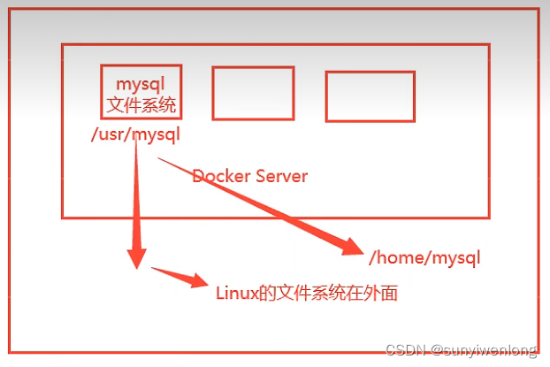
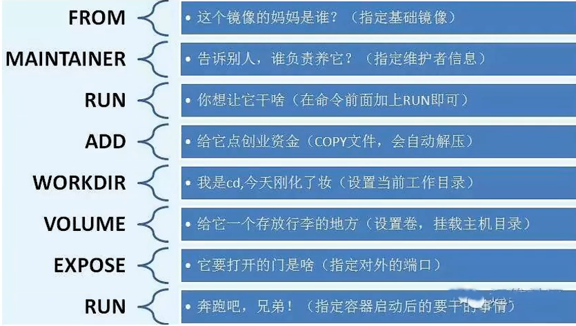

### docker 学习笔记

### 容器技术

容器技术是一种全新意义上的虚拟化技术，按分类或者实现方式来说，其应该属于操作系统虚拟化的范畴，也就是在由操作系统提供虚拟化的支持。
所谓容器技术，指的是操作系统自身支持一些接口，能够让应用程序间可以互不干扰的独立运行，并且能够对其在运行中所使用的资源进行干预
keyword：隔离，独立

### 容器 VS 虚拟器


1. 容器对比虚拟机少了虚拟操作系统和虚拟机监视器这两个层次，大幅减少了应用程序运行带来的额外消耗，但是由于没有指令转换不能解决程序跨平台兼容的问题。牺牲跨平台兼容问题，提高效率和资源利用。
2. docker利用的是宿主机的内核，vm需要是Guest OS

所以说，新建一个容器的时候，docker不需要像虚拟机一样重新加载一个操作系统内核，避免引导。
虚拟机是加载GuestOS，分钟级别的，而docker是利用宿主机的操作系统，省略了这个复杂的过程，秒级！

### Docker 项目是一个由 Go 语言实现的容器引擎

#### docker能做什么

1. 更快、更一致的交付你的应用程序
  使用 Docker 后，开发者能够在本地容器中得到一套标准的应用或服务的运行环境，由此可以简化开发的生命周期 ( 减少在不同环境间进行适配、调整所造成的额外消耗 )。对于整个应用迭代来说，加入 Docker 的工作流程将更加适合持续集成 ( Continuous Integration ) 和持续交付 ( Continuous Delivery )。
    举个具体的例子：
    * 开发者能够使用 Docker 在本地编写代码并通过容器与其他同事共享他们的工作。
    * 他们能够使用 Docker 将编写好的程序推送至测试环境进行自动化测试或是人工测试。
    * 当出现 Bugs 时，开发者可以在开发环境中修复它们，并很快的重新部署到测试环境中。
    * 在测试完成后，部署装有应用程序的镜像就能完成生产环境的发布。
2. 跨平台部署和动态伸缩
3. 让同样的硬件提供更多的产出能力
Docker 的高效和轻量等特征，为替代基于 Hypervisor 的虚拟机提供了一个经济、高效、可行的方案。在 Docker 下，你能节约出更多的资源投入到业务中去，让应用程序产生更高的效益。同时，如此低的资源消耗也说明了 Docker 非常适合在高密度的中小型部署场景中使用。

### docker核心组成

1. 镜像（Images）
只读文件包，其中包含了虚拟环境运行最原始文件系统的内容。
增量式镜像结构（Docker 的镜像实质上是无法被修改的，因为所有对镜像的修改只会产生新的镜像，而不是更新原有的镜像）
Docker 镜像其实是由基于 UnionFS 文件系统的一组镜像层依次挂载而得，而每个镜像层包含的其实是对上一镜像层的修改，这些修改其实是发生在容器运行的过程中的。所以可以反过来理解，镜像是对容器运行环境进行持久化存储的结果。
2. 容器（Container）
隔离出来的一种虚拟环境。
3. 网络（Network）
数据交换，容器间建立虚拟网络，将数个容器包裹其中，同时与其他网络环境隔离。
利用一些技术，Docker 能够在容器中营造独立的域名解析环境，这使得我们可以在不修改代码和配置的前提下直接迁移容器，Docker 会为我们完成新环境的网络适配。对于这个功能，我们甚至能够在不同的物理服务器间实现，让处在两台物理机上的两个 Docker 所提供的容器，加入到同一个虚拟网络中，形成完全屏蔽硬件的效果
4. 数据卷（Volume）
Union File System 技术

### 容器创建和启动

* Created：容器已经被创建，容器所需的相关资源已经准备就绪，但容器中的程序还未处于运行状态。
* Running：容器正在运行，也就是容器中的应用正在运行。
* Paused：容器已暂停，表示容器中的所有程序都处于暂停 ( 不是停止 ) 状态。
* Stopped：容器处于停止状态，占用的资源和沙盒环境都依然存在，只是容器中的应用程序均已停止。
* Deleted：容器已删除，相关占用的资源及存储在 Docker 中的管理信息也都已释放和移除

* -e 参数说明
-e的作用是指定容器内的环境变量。
mysql的镜像中是有一个初始化脚本的，这个脚本会读取这个变量初始化root的密码。
dockerfile中使用ENV指令指定环境变量

### 镜像

镜像是一种轻量级、可执行的独立软件包，用来打包软件运行环境和基于运行环境开发的软件，它包含运行某个软件所需的所有内容，包括代码、运行时、库、环境变量和配置文件。
所有的应用，直接打包docker镜像，就可以直接跑起来！比如说vue项目也可以打包成docker镜像

所有的Docker 镜像都起始于一个基础镜像层，当进行修改或增加新的内容时，就会在当前镜像层之上，创建新的镜像层

#### Docker镜像加速原理

1. UnionFS（联合文件系统）
docker的镜像实际上由一层一层的文件系统组成，这种层级的文件系统叫UnionFS

Union文件系统（UnionFS）是一种分层、轻量级并且高性能的文件系统，它支持对文件系统的修改作为一次提交来一层层的叠加，同时可以将不同目录挂载到同一个虚拟文件系统下（unite several directories into a single virtual filesystem）。Union 文件系统是Docker 镜像的基础。镜像可以通过分层来进行继承，基于基础镜像（没有父镜像），可以制作各种具体的应用镜像

特性：一次同时加载多个文件系统，但从外面看起来，只能看到一个文件系统，联合加载会把各层文件系统叠加起来，这样最终的文件系统会包含所有底层的文件和目录。

2. Docker镜像加载原型

bootfs（boot file system）主要包含 __bootloader__ 和 __kernel__，bootloader主要是引导加载kernel，Linux刚启动时会加载bootfs文件系统，在Docker镜像的最底层是bootfs。这一层与我们典型的Linux/Unix系统是一样的，包含boot加载器和内核。当boot加载完成之后整个内核就都在内存中了，此时内存的使用权已由bootfs转交给内核，此时系统也会卸载bootfs。

rootfs（root file system），在bootfs之上。包含的就是典型Linux系统中的/dev，/proc，/bin，/etc等标准目录和文件。

### 数据卷

Docker 容器中的文件系统于我们这些开发使用者来说，虽然有很多优势，但也有很多弊端，其中显著的两点就是：

1. 沙盒文件系统是跟随容器生命周期所创建和移除的，数据无法直接被持久化存储。
2. 由于容器隔离，我们很难从容器外部获得或操作容器内部文件中的数据

当然，Docker 很好的解决了这些问题，这主要还是归功于 Docker 容器文件系统是基于 UnionFS。由于 UnionFS 支持挂载不同类型的文件系统到统一的目录结构中，所以我们只需要将宿主操作系统中，文件系统里的文件或目录挂载到容器中，便能够让容器内外共享这个文件。所以就是容器数据卷。

Docker数据卷实质上是一个可供容器使用的特殊目录（或者称为存储空间），它能够将宿主机操作系统中的目录直接映射给容器，通过这种方式将宿主机目录映射（类似于Linux系统中mount行为）给容器使用

容器之间可以有一个数据共享的技术！Docker容器中产生的数据，同步到本地！
这就是卷技术！目录的挂载，将我们容器内的目录，挂载到Linux主机上面


__可在容器内部或者宿主机本地修改数据卷内的数据，且修改会立马生效，这也提高了Docker数据管理的效率__
__数据卷可以在容器之间共用和重用，这能够提高容器间数据传递的效率__
__对数据卷的更新不会影响镜像，实现了应用和数据的解耦，既提高了容器的稳定性，也保障了数据的安全性__

#### 挂载方式

1. Bind Mount 能够直接将宿主操作系统中的目录和文件挂载到容器内的文件系统中，通过指定容器外的路径和容器内的路径，就可以形成挂载映射关系，在容器内外对文件的读写，都是相互可见的
2. Volume 也是从宿主操作系统中挂载目录到容器内，只不过这个挂载的目录由 Docker 进行管理，我们只需要指定容器内的目录，不需要关心具体挂载到了宿主操作系统中的哪里
3. Tmpfs Mount 支持挂载系统内存中的一部分到容器的文件系统里，不过由于内存和容器的特征，它的存储并不是持久的，其中的内容会随着容器的停止而消失

### DockerFile

#### DockerFile介绍

dockerfile是用来构建docker镜像的文件！命令参数脚本！

构建步骤：

1. 编写一个dockerfile文件
2. docker build 构建成为一个镜像
3. docker run运行镜像
4. docker push发布镜像（DockerHub、阿里云镜像仓库！）

#### dockerFile构建过程

* 基础知识
1、每个保留关键字（指令）都是必须是大写字母
2、执行从上到下顺序执行
3、# 表示注释
4、每一个指令都会创建提交一个新的镜像层，并提交！
* 文件意思
DockerFile：构建文件，定义了一切的步骤，源代码。
Dockerlmages：通过DockerFile构建生成的镜像，最终发布和运行的产品。
Docker容器：容器就是镜像运行起来提供服务的。

#### dockerFile命令

* FROM  基础镜像，一切从这里开始构建
* MAINTAINER 镜像是谁写的：姓名+邮箱 遗弃？用LABEL代替
* LABEL令用来给镜像以键值对的形式添加一些元数据（metadata）
* RUN  镜像构建的时候需要运行的命令
* WORKDIR  镜像的工作目录
* VOLUME   挂载的目录
* EXPOSE  暴露端口配置

* ONBUILD   当构建一个被继承DockerFile这个时候就会运行ONBUILD的指令。触发指令。
* COPY    类似ADD，将我们文件拷贝到镜像中
  COPY 指令将从构建上下文目录中 <源路径> 的文件/目录复制到新的一层的镜像内的 <目标路径> 位置

  ```shell
    COPY [--chown=<user>:<group>] <源路径>... <目标路径>
    COPY [--chown=<user>:<group>] ["<源路径1>",... "<目标路径>"]

  ```

  ```shell
    COPY package.json /usr/src/app/
  ```

  <源路径> 可以是多个，甚至可以是通配符

  ```shell
    COPY hom* /mydir/
    COPY hom?.txt /mydir/
  ```

  <目标路径> 可以是容器内的绝对路径，也可以是相对于工作目录的相对路径（工作目录可以用 WORKDIR 指令来指定）。目标路径不需要事先创建，如果目录不存在会在复制文件前先行创建缺失目录
* ADD  更高级的COPY功能
ADD 指令和 COPY 的格式和性质基本一致。但是在 COPY 基础上增加了一些功能

比如 <源路径> 可以是一个 URL，这种情况下，Docker 引擎会试图去下载这个链接的文件放到 <目标路径> 去。下载后的文件权限自动设置为 600，如果这并不是想要的权限，那么还需要增加额外的一层 RUN 进行权限调整，另外，如果下载的是个压缩包，需要解压缩，也一样还需要额外的一层 RUN 指令进行解压缩。所以不如直接使用 RUN 指令，然后使用 wget 或者 curl 工具下载，处理权限、解压缩、然后清理无用文件更合理。因此，这个功能其实并不实用，而且不推荐使用。
如果 <源路径> 为一个 tar 压缩文件的话，压缩格式为 gzip, bzip2 以及 xz 的情况下，ADD 指令将会自动解压缩这个压缩文件到 <目标路径> 去

因此在 COPY 和 ADD 指令中选择的时候，可以遵循这样的原则，所有的文件复制均使用 COPY 指令，仅在需要自动解压缩的场合使用 ADD

* CMD  指定这个容器启动的时候要运行的命令，只有最后一个会生效，可被替代
在启动容器的时候，需要指定所运行的程序及参数。CMD 指令就是用于指定默认的容器主进程的启动命令的
  1. shell 格式：CMD <命令>
  2. exec 格式：CMD ["可执行文件", "参数1", "参数2"...]
  3. 参数列表格式：CMD ["参数1", "参数2"...]。在指定了 ENTRYPOINT 指令后，用 CMD 指定具体的参数

```shell
CMD ["nginx", "-g", "daemon off;"] #直接执行 nginx 可执行文件，并且要求以前台形式运行
```

* ENTRYPOINT  指定这个容器启动的时候要运行的命令，可以追加命令
ENTRYPOINT 的目的和 CMD 一样，都是在指定容器启动程序及参数。ENTRYPOINT 在运行时也可以替代，不过比 CMD 要略显繁琐，需要通过 docker run 的参数 --entrypoint 来指定
当指定了 ENTRYPOINT 后，CMD 的含义就发生了改变，不再是直接的运行其命令，而是将 CMD 的内容作为参数传给 ENTRYPOINT 指令，换句话说实际执行时
* ENV     构建的时候设置环境变量！

```shell
ENV <key1>=<value1> <key2>=<value2>...
ENV <key> <value>
```

```shell
ENV MYPATH /usr/local
WORKDIR $MYPATH # 这里就是/usr/local
```



### 网络

#### 容器网络

容器网络实质上也是由 Docker 为应用程序所创造的虚拟环境的一部分，它能让应用从宿主机操作系统的网络环境中独立出来，形成容器自有的网络设备、IP 协议栈、端口套接字、IP 路由表、防火墙等等与网络相关的模块。

容器网络模型的三个核心点：

* 沙盒
提供了容器的虚拟网络栈，也就是之前所提到的端口套接字、IP 路由表、防火墙等的内容。其实现隔离了容器网络与宿主机网络，形成了完全独立的容器网络环境。
* 网络
可以理解为 Docker 内部的虚拟子网，网络内的参与者相互可见并能够进行通讯。Docker 的这种虚拟网络也是于宿主机网络存在隔离关系的，其目的主要是形成容器间的安全通讯环境。
* 端点
端点是位于容器或网络隔离墙之上的洞，其主要目的是形成一个可以控制的突破封闭的网络环境的出入口。当容器的端点与网络的端点形成配对后，就如同在这两者之间搭建了桥梁，便能够进行数据传输了。

#### 网络命令

* 管理网络列表

```bash
docker network ls 
```

 1. host模式：使用 --net=host 指定。
 2. none模式：使用 --net=none 指定。
 3. bridge模式：使用 --net=bridge 指定，默认设置。
 4. container模式：使用 --net=container:NAME_or_ID 指定


* 创建网络

```bash
docker network create -d bridge individual
```

通过 -d 选项我们可以为新的网络指定驱动的类型，其值可以是刚才我们所提及的 bridge、host、none

* 暴露端口
--expose

```bash
sudo docker run -d --name mysql -e MYSQL_RANDOM_ROOT_PASSWORD=yes --expose 13306 --expose 23306 mysql:5.7 // 暴露13306 23306端口 在docker ps就能看到
```

#### 容器互联

--link

```
sudo docker run -d --name webapp --link mysql webapp:latest
```

别名链接

```
sudo docker run -d --name webapp --link mysql:database webapp:latest
```

--link \<name>:\<alias> 的形式，连接到 MySQL 容器，并设置它的别名为 database

-------上述我没怎么搞懂，回头再搞一次--------

* 另几种方式

 1. 在容器启动时，启动命令中加入links指定链接的容器:(对应下面的端口映射)

 ```
 docker run -itd --name nginx-web02 --link nginx-web:nginx01 -p 81:81 sunmmi/nginx nginx
 ```

 run容器nginx-web02时，link容器nginx-web,其中nginx-web：nginx01前面是链接哪个容器名，后面是对这个容器别名.
 2. 也是在容器启动时，启动命令中加入network指定局域网络
  创建一个新的 Docker 网络

  ```
  docker network create -d bridge my-net
  ```

  运行一个容器并连接到新建的 my-net 网络

  ```
  docker run -it --rm --name busybox1 --network my-net busybox sh
  ```

  打开新的终端，再运行一个容器并加入到 my-net 网络

  ```
  docker run -it --rm --name busybox2 --network my-net busybox sh
  ```

  过 ping 来证明 busybox1 容器和 busybox2 容器建立了互联关系

  ```
  ping busybox1
  ```

  ```
  ping busybox2
  ```

#### 端口映射

通过 Docker 端口映射功能，我们可以把容器的端口映射到宿主操作系统的端口上，当我们从外部访问宿主操作系统的端口时，数据请求就会自动发送给与之关联的容器端口。
要映射端口，我们可以在创建容器时使用 -p 或者是 --publish 选项。

```
sudo docker run -d --name nginx -p 80:80 -p 443:443 nginx:1.12
```

使用端口映射选项的格式是 -p \<ip>:\<host-port>:\<container-port>，其中 ip 是宿主操作系统的监听 ip，可以用来控制监听的网卡，默认为 0.0.0.0，也就是监听所有网卡。host-port 和 container-port 分别表示映射到宿主操作系统的端口和容器的端口，这两者是可以不一样的，我们可以将容器的 80 端口映射到宿主操作系统的 8080 端口，传入 -p 8080:80 即可。
