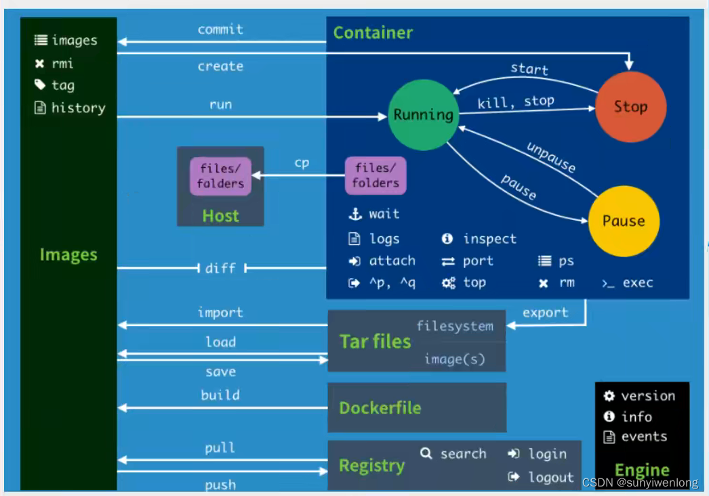
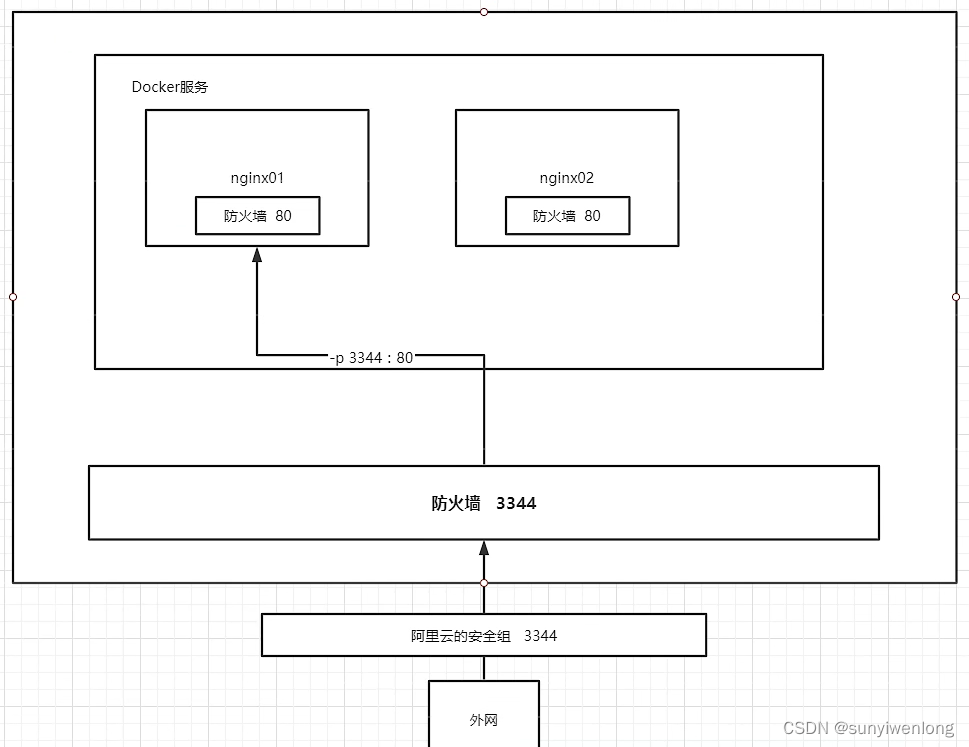

# docker 实操学习笔记

### docker在linux下的安装

具体文档在[官网地址](!https://docs.docker.com/engine/install/centos/)

1. 卸载旧的版本

```shell
yum remove docker \
          docker-client \
          docker-client-latest \
          docker-common \
          docker-latest \
          docker-latest-logrotate \
          docker-logrotate \
          docker-engine
```

2. 需要的安装包

```shell
yum install -y yum-utils
```

3. 设置镜像的仓库(默认镜像是国外的，改成阿里云的镜像)

```shell
yum-config-manager \
    --add-repo \
    http://mirrors.aliyun.com/docker-ce/linux/centos/docker-ce.repo
```

4. 安装容器之前，更新yum软件包索引。

```shell
yum makecache fast
```

5. 安装容器相关的。docker-ce（社区版）docker-ee（企业版）

```shell
yum install docker-ce docker-ce-cli containerd.io
```

6. 启动docker

```shell
systemctl start docker
```

7. Docker 服务开机自启动

```bash
sudo systemctl enable docker
```

8. 使用docker version查看是否安装成功

```shell
docker version
```

eg:
/var/lib/docker  docker的默认工作路径
卸载docker流程：

1. 卸载依赖

```shell
yum remove docker-ce docker-ce-cli containerd.io
```

2. 删除资源

```shell
rm -rf /var/lib/docker
rm -rf /var/lib/containerd
```

### docker常用命令

#### 帮助命令

帮助文档的地址[文档](!https://docs.docker.com/reference/)

```shell
docker version        # 显示docker的版本信息
docker info              # 显示docker的系统信息，包括镜像和容器的数量
docker 命令 --help         # 帮助命令
```

#### 镜像命令

* dokcer images 查看所有本地的主机上的镜像

```shell
[root@VM-24-4-centos ~]# docker images
REPOSITORY    TAG       IMAGE ID       CREATED        SIZE
hello-world   latest    9c7a54a9a43c   7 months ago   13.3kB

# 解释
REPOSITORY    镜像的仓库源
TAG            镜像的标签
IMAGE ID    镜像的id
CREATED        镜像的创建时间
SIZE        镜像的大小

# 命令参数可选项
 -a, --all         # 显示所有镜像 (docker images -a)
 -q, --quiet       # 仅显示镜像id (docker images -q)
```

* docker search 搜索镜像
类似于docker hub下的搜索镜像是一样的，只不过网站打开太慢，可以用命令去搜索

```shell
[root@VM-24-4-centos ~]# docker search mongodb
NAME                                                   DESCRIPTION                                      STARS     OFFICIAL   AUTOMATED
mongo                                                  MongoDB document databases provide high avai…   9985      [OK]       
mongo-express                                          Web-based MongoDB admin interface, written w…   1384      [OK]       
mongodb/mongodb-atlas-kubernetes-operator              The MongoDB Atlas Kubernetes Operator - Kube…   5                    
mongodb/mongodb-community-server                       The Official MongoDB Community Server            59                   


# 解释
# 命令参数可选项 (通过搜索来过滤)
--filter=STARS=3000     # 搜索出来的镜像就是stars大于3000的

```

* docker inspect 镜像名 查找当前容器下的某个镜像的具体信息，若镜像不存在，那么会返回空的数组

```shell
[root@VM-24-4-centos ~]# docker inspect mysql
[
    {
        "Id": "sha256:f7fdab215ab77d3c9f93d4a1afa4b77850bc1b1ed1372ffe31b96ad9cd78a07e",
        "RepoTags": [
            "mysql:latest"
        ],
        #......
    }
]


```

* docker pull 下载镜像

```shell
# docker pull 镜像名[:tag]
[root@VM-24-4-centos ~]# docker pull mysql
Using default tag: latest              # 如果不写tag，默认就是latest，最新的版本
latest: Pulling from library/mysql
e9f2695d7e5b: Pull complete 
c041cd0148ec: Pull complete            # 分层下载，docker image的核心，联合文件下载
27c9fbf7aa29: Pull complete 
62fc1efc1f1f: Pull complete 
e1d25a6611c2: Pull complete 
5846de7fe479: Pull complete 
faf13e3256e8: Pull complete 
2217ed684a4f: Pull complete 
45bfd3acf105: Pull complete 
5b68afdb04ae: Pull complete 
Digest: sha256:6057dec95d87a0d7880d9cfc9b3d9292f9c11473a5104b906402a2b73396e377   #签名
Status: Downloaded newer image for mysql:latest   
docker.io/library/mysql:latest      # 真实地址


# 两个命令是等价的
docker pull mysql
docker pull docker.io/library/mysql:latest


```

* docker rmi 删除镜像

```shell
[root@VM-24-4-centos ~]# docker images
REPOSITORY    TAG       IMAGE ID       CREATED        SIZE
mysql         latest    f7fdab215ab7   6 weeks ago    605MB
mysql         5.7       bdba757bc933   6 weeks ago    501MB
hello-world   latest    9c7a54a9a43c   7 months ago   13.3kB
[root@VM-24-4-centos ~]# docker rmi -f bdba757bc933  # bdba757bc933就是上述的image id
Untagged: mysql:5.7
Untagged: mysql@sha256:f566819f2eee3a60cf5ea6c8b7d1bfc9de62e34268bf62dc34870c4fca8a85d1
Deleted: sha256:bdba757bc9336a536d6884ecfaef00d24c1da3becd41e094eb226076436f258c
Deleted: sha256:83a17753737aa4e9b2befa4b2715d0b11ddb2c95bd2a0f9554b422ceb6b800c2
Deleted: sha256:cd979ae03174aa5d223b6c7a7c3ef66a772f809ee56f5ec88c04a0bc24373501
# ...

```

```shell
docker rmi -f 镜像id 镜像id 镜像id    # 删除多个镜像（空格分隔）
```

```shell
docker rmi -f $(docker images -aq)    # 删除全部的镜像
```

#### 容器命令

说明：我们有了镜像才可以创建容器,一个镜像可以创建多个容器，容器可以理解为简易版的linux

* 创建容器

```shell
docker create --name 名字 镜像名
```

* 启动容器

```shell
docker start name
```

__注意：docker run 类似于 docker create + docker start，相当于前台运行方式__

```shell
docker run --name nginx -d nginx:1.12 
# -d 或 --detach 这个选项告诉 Docker 在启动后将程序与控制台分离，使其进入“后台”运行
```

* 新建容器并启动

```shell
docker run [可选参数] image
# 每次run一个镜像，代表创建过一个容器
# 参数说明
--name name        容器名字：用来区分容器
-d                    后台方式运行：相当于nohup
-it                    使用交互式运行：进入容器查看内容
-p                    指定容器的端口（四种方式）小写字母p
    -p ip:主机端口：容器端口
    -p 主机端口：容器端口
    -p 容器端口
    容器端口
-P                     随机指定端口（大写字母P）

```

```shell
# 测试：启动并进入容器
[root@VM-24-4-centos /]# docker run -it centos /bin/bash
[root@740c2b42aea4 /]# ls
bin  dev  etc  home  lib  lib64  lost+found  media  mnt  opt  proc  root  run  sbin  srv  sys  tmp  usr  var
```

```shell
# 从容器中退回到主机
[root@740c2b42aea4 /]# exit
exit
[root@VM-24-4-centos /]# ls
bin  boot  data  dev  etc  home  lib  lib64  lost+found  media  mnt  opt  proc  root  run  sbin  srv  sys  tmp  usr  var

```

* 列出所有运行的容器
docker ps 列出当前正在运行的容器

```shell
docker ps [可选参数]    # 列出当前正在运行的容器

# 命令参数可选项
-a        # 列出当前正在运行的容器+历史运行过的容器
-n=?    # 显示最近创建的容器（可以指定显示几条，比如-n=1）
-q        # 只显示容器的编号

```

```shell
[root@VM-24-4-centos /]# docker ps
CONTAINER ID   IMAGE     COMMAND   CREATED   STATUS    PORTS     NAMES
[root@VM-24-4-centos /]# docker ps -n=2
CONTAINER ID   IMAGE     COMMAND           CREATED         STATUS                          PORTS     NAMES
740c2b42aea4   centos    "/bin/bash"       2 minutes ago   Exited (0) About a minute ago             peaceful_mendel
efe2f97196b0   centos    "-it /bin/bash"   2 minutes ago   Created                                   hopeful_rhodes
[root@VM-24-4-centos /]# docker ps -a
CONTAINER ID   IMAGE          COMMAND                   CREATED          STATUS                          PORTS     NAMES
740c2b42aea4   centos         "/bin/bash"               2 minutes ago    Exited (0) About a minute ago             peaceful_mendel
efe2f97196b0   centos         "-it /bin/bash"           2 minutes ago    Created                                   hopeful_rhodes
6f26cd645a74   9c7a54a9a43c   "/hello"                  25 hours ago     Exited (0) 25 hours ago                   crazy_hellman
[root@VM-24-4-centos ~]# docker ps
CONTAINER ID   IMAGE     COMMAND                   CREATED          STATUS              PORTS                 NAMES
3368012d4b6b   mysql     "docker-entrypoint.s…"   58 seconds ago   Up 6 seconds        3306/tcp, 33060/tcp   bold_chaplygin
601cc86ebbd5   centos    "/bin/bash"               3 minutes ago    Up About a minute                         stupefied_galois
[root@VM-24-4-centos ~]# docker ps -q
3368012d4b6b
601cc86ebbd5


```

* 退出容器

```shell
exit        # 容器直接停止，并退出
```

```shell
ctrl + p + q        # 容器退出,但后台在运行
```

* 删除容器

```shell
docker rm 容器id                    # 删除容器（不能删除正在运行的容器）如果要强制删除：docker rm -f 容器id
docker rm -f $(docker ps -aq)        # 删除全部容器
docker ps -a -q|xargs docker rm        # 删除所有容器
```

* 启动和停止容器的操作

```shell
docker start 容器id        # 启动容器
docker restart 容器id    # 重启容器
docker stop 容器id        # 停止当前正在运行的容器
docker kill 容器id        # 强制停止当前容器
```

* 问题
运行了一个容器，但是docker ps却没有，docker ps -a显示的容器是exit状态，这是因为 __docker容器使用后台运行，就必须要有要一个前台进程，docker发现没有应用，就会自动停止__
比如：nginx，容器启动后，发现自己没有提供服务，就会立刻停止，就是没有程序了

#### 常用其他命令

* docker logs 查看日志

```shell
docker logs -t -f --tail 容器id
# 显示日志
-t   # 日志加时间
-f   # 保留打印窗口
--tail number    # 要显示的最后日志条数
```

* 查看容器中进程的信息

```shell
docker top 容器id 

[root@VM-24-4-centos ~]# docker ps
CONTAINER ID   IMAGE     COMMAND       CREATED         STATUS         PORTS     NAMES
f6697a331bd7   centos    "/bin/bash"   5 minutes ago   Up 5 minutes             thirsty_chandrasekhar
[root@VM-24-4-centos ~]# docker top f6697a331bd7
UID                 PID                 PPID                C                   STIME               TTY                 TIME                CMD
root                29624               29602               0                   18:23               pts/0               00:00:00            /bin/bash

```

* 查看容器的元数据

```shell
docker inspect 容器id
```

* 进入当前正在运行的容器
我们通常容器都是使用后台方式运行的，需要进入容器，修改一些配置
  * 方式一：

    ```shell
    docker exec -i # ( --interactive ) 表示保持我们的输入流，只有使用它才能保证控制台程序能够正确识别我们的命令
    docker exec -t # ( --tty ) 表示启用一个伪终端，形成我们与 bash 的交互，如果没有它，我们无法看到 bash 内部的执行结果。
    docker exec -it # ( -i 与 -t 简写)

    docker exec -it 容器id /bin/bash
    # 进入容器后开启一个新的终端，可以再里面操作（常用）

    [root@VM-24-4-centos ~]# docker exec -it f6697a331bd7 /bin/bash
    [root@f6697a331bd7 /]# ls
    bin  dev  etc  home  lib  lib64  lost+found  media  mnt  opt  proc  root  run  sbin  srv  sys  tmp  usr  var
    [root@f6697a331bd7 /]# exit
    exit
    [root@VM-24-4-centos ~]# docker ps
    CONTAINER ID   IMAGE     COMMAND       CREATED          STATUS          PORTS     NAMES
    f6697a331bd7   centos    "/bin/bash"   31 minutes ago   Up 31 minutes             thirsty_chandrasekhar
    # 发现退出的时候依然在运行
    ```

    ```shell
      docker exec -it num bash #进入容器num内部,并以bash方式运行
      whereis nginx # nginx 位置
      cd /usr/sbin # 到sbin 目录下
      ./nginx -s stop  # 停止nginx
      # 输入流自动被关闭回到控制台
    ```

  ps: docker attach命令stdin的退出也会导致容器的停止，docker exec不会

  * 方式二

    ```shell
    docker attach 容器id
    # 进入容器正在执行的终端，不会启动新的进程
    ```

* 从容器内拷贝文件到主机上

```shell
[root@VM-24-4-centos ~]# docker attach f6697a331bd7 # 进入到容器内部
[root@f6697a331bd7 /]# ls
bin  dev  etc  home  lib  lib64  lost+found  media  mnt  opt  proc  root  run  sbin  srv  sys  tmp  usr  var
[root@f6697a331bd7 /]# cd home/
[root@f6697a331bd7 home]# touch index.js # 在容器的/home路径下创建index.js文件
[root@f6697a331bd7 home]# exit
exit
[root@VM-24-4-centos ~]# docker cp f6697a331bd7:/home/index.js /home # 将文件拷贝出来到主机上（在主机上执行该命令）
                                              Successfully copied 1.54kB to /home
[root@VM-24-4-centos ~]# cd ..
[root@VM-24-4-centos /]# cd home
[root@VM-24-4-centos home]# ls
index.js  lighthouse

```

* 容器提交
和git的commit提交一样，主要提交到远程？

```shell
docker commit -m='提交信息' -a='作者' 容器id 目标镜像名:[TAG]
```

```shell
[root@VM-24-4-centos ~]# docker ps
CONTAINER ID   IMAGE     COMMAND                   CREATED      STATUS      PORTS                                   NAMES
3f9f2d52b478   nginx     "/docker-entrypoint.…"   8 days ago   Up 8 days   0.0.0.0:3340->80/tcp, :::3340->80/tcp   nginx-01
[root@VM-24-4-centos ~]# docker exec -it 3f9f2d52b478 bash
root@3f9f2d52b478:/# ls
bin  boot  dev  docker-entrypoint.d  docker-entrypoint.sh  etc  home  lib  lib32  lib64  libx32  media  mnt  opt  proc  root  run  sbin  srv  sys  tmp  usr  var
root@3f9f2d52b478:/# cd home
root@3f9f2d52b478:/home# ls
root@3f9f2d52b478:/home# touch index.js
root@3f9f2d52b478:/home# ls
index.js
root@3f9f2d52b478:/home# exit
exit
[root@VM-24-4-centos ~]# docker ps -a
CONTAINER ID   IMAGE     COMMAND                   CREATED      STATUS                  PORTS                                   NAMES
3f9f2d52b478   nginx     "/docker-entrypoint.…"   8 days ago   Up 8 days               0.0.0.0:3340->80/tcp, :::3340->80/tcp   nginx-01
f6697a331bd7   centos    "/bin/bash"               8 days ago   Exited (0) 8 days ago                                           thirsty_chandrasekhar
3af81e122eae   centos    "/bin/bash"               8 days ago   Exited (0) 8 days ago                                           peaceful_wing
[root@VM-24-4-centos ~]# docker commit -m='add file test' -a='17' 3f9f2d52b478 nginx-2:1.0 # nginx-2:1.0代表着新起的名和版本
sha256:8d1a1a49aeed4e823a3c8046a39d5cb86499c221a34c39a2b87be3cbebfd2cea
[root@VM-24-4-centos ~]# docker images
REPOSITORY   TAG       IMAGE ID       CREATED          SIZE
nginx-2      1.0       8d1a1a49aeed   25 seconds ago   187MB
nginx        latest    a6bd71f48f68   3 weeks ago      187MB
mysql        latest    f7fdab215ab7   7 weeks ago      605MB
centos       latest    5d0da3dc9764   2 years ago      231MB

```

所谓的commit的就是在当前的容器下复制一个副本，并在副本做了任何操作，提交上去，下次使用镜像时可以继续使用这个副本

#### 小结



#### 测试：docker安装nginx

```shell
[root@VM-24-4-centos /]# docker pull nginx # 拉取nginx
Using default tag: latest
latest: Pulling from library/nginx
1f7ce2fa46ab: Pull complete 
9b16c94bb686: Pull complete 
9a59d19f9c5b: Pull complete 
9ea27b074f71: Pull complete 
c6edf33e2524: Pull complete 
84b1ff10387b: Pull complete 
517357831967: Pull complete 
Digest: sha256:10d1f5b58f74683ad34eb29287e07dab1e90f10af243f151bb50aa5dbb4d62ee
Status: Downloaded newer image for nginx:latest
docker.io/library/nginx:latest
[root@VM-24-4-centos /]# docker run -d --name nginx-01 -p 3340:80 nginx
# -d 或 --detach 这个选项告诉 Docker 在启动后将程序与控制台分离，使其进入“后台”运行
# --name 设置bieming
# -p 宿主机端口:容器内部端口 外部通过3340端口访问容器里的80端口，默认端口是80
3f9f2d52b47866c029cfdc7671831c5eff57fa5d00ec735e9d25495e828f3ac6
[root@VM-24-4-centos /]# docker ps
CONTAINER ID   IMAGE     COMMAND                   CREATED         STATUS         PORTS                                   NAMES
3f9f2d52b478   nginx     "/docker-entrypoint.…"   4 seconds ago   Up 3 seconds   0.0.0.0:3340->80/tcp, :::3340->80/tcp   nginx-01
[root@VM-24-4-centos /]# docker exec -it 3f9f2d52b478 /bin/bash
# 以bash进入nginx-01容器内
root@3f9f2d52b478:/# ls
bin  boot  dev  docker-entrypoint.d  docker-entrypoint.sh  etc  home  lib  lib32  lib64  libx32  media  mnt  opt  proc  root  run  sbin  srv  sys  tmp  usr  var
root@3f9f2d52b478:/# whereis nginx 
# whereis 查找某个应用的位置
nginx: /usr/sbin/nginx /usr/lib/nginx /etc/nginx /usr/share/nginx
root@3f9f2d52b478:/# cd /etc/nginx/
root@3f9f2d52b478:/etc/nginx# ls
conf.d  fastcgi_params  mime.types  modules  nginx.conf  scgi_params  uwsgi_params
root@3f9f2d52b478:/etc/nginx# exit
exit
[root@VM-24-4-centos /]# curl http://localhost:3340
<!DOCTYPE html>
<html>
<head>
<title>Welcome to nginx!</title>
<style>
html { color-scheme: light dark; }
body { width: 35em; margin: 0 auto;
font-family: Tahoma, Verdana, Arial, sans-serif; }
</style>
</head>
<body>
<h1>Welcome to nginx!</h1>
<p>If you see this page, the nginx web server is successfully installed and
working. Further configuration is required.</p>

<p>For online documentation and support please refer to
<a href="http://nginx.org/">nginx.org</a>.<br/>
Commercial support is available at
<a href="http://nginx.com/">nginx.com</a>.</p>

<p><em>Thank you for using nginx.</em></p>
</body>
</html>

```

#### 端口暴漏的概念



#### 数据卷volume

```shell
docker run -it -v 主机目录:容器内目录 镜像名 bash
```

测试：

1. 在当前环境下home/volumeTest挂载centos容器下的home的文件
2. 在centos容器下的home下创建index.js文件
3. 退出centos容器
4. 在当前环境下home/volumeTest查看index.js文件是否存在

```shell
[root@VM-24-4-centos ~]# ls
[root@VM-24-4-centos ~]# cd ..
[root@VM-24-4-centos /]# ls
bin  boot  data  dev  etc  home  lib  lib64  lost+found  media  mnt  opt  proc  root  run  sbin  srv  sys  tmp  usr  var
[root@VM-24-4-centos /]# cd home
[root@VM-24-4-centos home]# ls
index.js  lighthouse
[root@VM-24-4-centos home]# docker run --name centos-1 -it -v /home/volumeTest:/home centos bash
[root@315c99101cd3 /]# ls
bin  dev  etc  home  lib  lib64  lost+found  media  mnt  opt  proc  root  run  sbin  srv  sys  tmp  usr  var
[root@315c99101cd3 /]# cd home
[root@315c99101cd3 home]# ls
[root@315c99101cd3 home]# touch index.js
[root@315c99101cd3 home]# exit
exit
[root@VM-24-4-centos home]# ls
index.js  lighthouse  volumeTest
[root@VM-24-4-centos home]# cd volumeTest/
[root@VM-24-4-centos volumeTest]# ls
index.js
[root@VM-24-4-centos volumeTest]# docker ps -a
CONTAINER ID   IMAGE         COMMAND                   CREATED              STATUS                      PORTS                                   NAMES
315c99101cd3   centos        "bash"                    About a minute ago   Exited (0) 59 seconds ago                                           centos-1

[root@VM-24-4-centos volumeTest]# docker inspect centos-1
[
    {
      #...
        "Mounts": [
            {
                "Type": "bind",
                "Source": "/home/volumeTest",
                "Destination": "/home",
                "Mode": "",
                "RW": true,
                "Propagation": "rprivate"
            }
        ],
      #...  
    }
]


```

测试：

1. 在当前环境下home/volumeTest的index.js文件写下hello world
2. 运行centos-1容器
3. 进入到centos-1容器下，查看/home下index.js文件是否有hello world

```shell
[root@VM-24-4-centos volumeTest]# ls
index.js
[root@VM-24-4-centos volumeTest]# vim index.js 
[root@VM-24-4-centos volumeTest]# docker ps -a
CONTAINER ID   IMAGE         COMMAND                   CREATED         STATUS                      PORTS                                   NAMES
315c99101cd3   centos        "bash"                    4 minutes ago   Exited (0) 4 minutes ago                                            centos-1
[root@VM-24-4-centos volumeTest]# docker start 315c99101cd3
315c99101cd3
[root@VM-24-4-centos volumeTest]# docker ps -a
CONTAINER ID   IMAGE         COMMAND                   CREATED         STATUS                      PORTS                                   NAMES
315c99101cd3   centos        "bash"                    6 minutes ago   Up 21 seconds                                                       centos-1                                  peaceful_wing
[root@VM-24-4-centos volumeTest]# docker exec -it centos-1 bash
[root@315c99101cd3 /]# ls
bin  dev  etc  home  lib  lib64  lost+found  media  mnt  opt  proc  root  run  sbin  srv  sys  tmp  usr  var
[root@315c99101cd3 /]# cd home
[root@315c99101cd3 home]# ls
index.js
[root@315c99101cd3 home]# cat index.js 
hello world

```

__这下可以说明，挂载的数据卷双方是同步的__

##### 匿名和具名挂载

```shell
#具名挂载
docker run -d -p 3344:80 --name nginx02 -v juming-nginx:/etc/nginx nginx
# 匿名挂载
docker run -d -p 3344:80 --name nginx01 -v /etc/nginx nginx
# 具体路径挂载
docker run -d -p 3344:80 --name nginx02 -v /home/juming-nginx:/etc/nginx nginx
```

```shell
# 匿名挂载
docker run -d -p --name nginx01 -v /etc/nginx nginx
# 查看所有的volume的情况
[root@iZbp13qr3mm4ucsjumrlgqZ ~]# docker volume ls
DRIVER    VOLUME NAME
local     964b8e505f12f65fb23fd21f05cfa9ecd6c2c6b2ca89c0e44f168bb017dfabd6
# 这种就是匿名挂载：我们在-v挂载目录时，只写了容器内的路径，没有写容器外的路径。
# 具名挂载
[root@iZbp13qr3mm4ucsjumrlgqZ ~]# docker run -d -p 3344:80 --name nginx02 -v juming-nginx:/etc/nginx nginx
[root@iZbp13qr3mm4ucsjumrlgqZ ~]# docker volume ls
DRIVER    VOLUME NAME
local     964b8e505f12f65fb23fd21f05cfa9ecd6c2c6b2ca89c0e44f168bb017dfabd6
local     juming-nginx
# 通过 -v 卷名:容器内的路径（具名挂载）
# 查看一下这个卷
[root@VM-24-4-centos home]# docker volume inspect juming-nginx
[
    {
        "CreatedAt": "2023-12-20T22:31:51+08:00",
        "Driver": "local",
        "Labels": null,
        "Mountpoint": "/var/lib/docker/volumes/juming-nginx/_data",
        "Name": "juming-nginx",
        "Options": null,
        "Scope": "local"
    }
]
#所有的docker容器内的卷，没有指定目录的情况下都是在/var/lib/docker/volumes/xxxx/_data"（xxxx是卷名）
```

如何确定是具名挂载，还是匿名挂载，还是指定路径挂载

* -v 容器内的路径                # 匿名挂载
* -v 卷名:容器内的路径        # 具名挂载
* -v /宿主机路径:容器内路径    # 指定路径挂载

拓展：
通过 -v 容器内的路径:ro    rw    改变读写权限

  1. ro    read only    # 只读
  2. rw    read write    # 可读可写
一旦设置了容器权限，容器对我们挂载出来的内容就有了限定。

```shell
docker run -d -p 3344:80 --name nginx02 -v juming-nginx:/etc/nginx:ro nginx # 只要看到ro就说明这个路径只能通过宿主机来操作，容器内部是无法操作！
docker run -d -p 3344:80 --name nginx02 -v juming-nginx:/etc/nginx:rw nginx
```

#### dockerFile

```shell
FROM        # 基础镜像，一切从这里开始构建
MAINTAINER    # 镜像是谁写的：姓名+邮箱
RUN            # 镜像构建的时候需要运行的命令
ADD            # 步骤：tomcat镜像，这个tomcat压缩包！添加内容
WORKDIR        # 镜像的工作目录
VOLUME        # 挂载的目录
EXPOSE        # 暴露端口配置
CMD            # 指定这个容器启动的时候要运行的命令，只有最后一个会生效，可被替代
ENTRYPOINT    # 指定这个容器启动的时候要运行的命令，可以追加命令
ONBUILD        # 当构建一个被继承DockerFile这个时候就会运行ONBUILD的指令。触发指令。
COPY        # 类似ADD，将我们文件拷贝到镜像中
ENV            # 构建的时候设置环境变量！
```

测试写一个在centos下新增net-tools和vim的功能，因为在centos镜像下是没有这些功能的

```shell
# mydockerfile-centos文件
FROM centos:7
LABLE name=17\
      email=852104785@qq.com
ENV mypath /usr/local
WORKDIR $MYPATH
RUN yum -y install vim
RUN yum -y install net-tools
EXPOSE 80
CMD echo $MYPATH
CMD echo "-----end-----"
CMD /bin/bash
```

```shell
# 构建镜像
# 命令：docker build -f dockerfile文件路径 -t 镜像名:[tag]
docker build -f mydockerfile-centos -t mycentos:0.1 .
```

```shell
[root@VM-24-4-centos ~]# cd /home
[root@VM-24-4-centos home]# ls
index.js  lighthouse  mongoTest  volumeTest
[root@VM-24-4-centos home]# mkdir dockerFile
[root@VM-24-4-centos home]# cd dockerFile/
[root@VM-24-4-centos dockerFile]# vim mydockerfile-centos
[root@VM-24-4-centos dockerFile]# docker build -f mydockerfile-centos -t mycentos:0.1 .
[+] Building 0.2s (2/2) FINISHED                                                                                                                               docker:default
 => [internal] load build definition from mydockerfile-centos                                                                                                            0.1s
 => => transferring dockerfile: 262B                                                                                                                                     0.0s
 => [internal] load .dockerignore                                                                                                                                        0.1s
 => => transferring context: 2B                                                                                                                                          0.0s
mydockerfile-centos:2
--------------------
   1 |     FROM centos:7
   2 | >>> LABLE name=17\
   3 | >>>       email=852104785@qq.com
   4 |     ENV mypath /usr/local
--------------------
ERROR: failed to solve: dockerfile parse error on line 2: unknown instruction: LABLE (did you mean LABEL?)
[root@VM-24-4-centos dockerFile]# vim mydockerfile-centos
[root@VM-24-4-centos dockerFile]# docker build -f mydockerfile-centos -t mycentos:0.1 .
[+] Building 73.6s (7/7) FINISHED                                                                                                                              docker:default
 => [internal] load build definition from mydockerfile-centos                                                                                                            0.0s
 => => transferring dockerfile: 262B                                                                                                                                     0.0s
 => [internal] load .dockerignore                                                                                                                                        0.0s
 => => transferring context: 2B                                                                                                                                          0.0s
 => [internal] load metadata for docker.io/library/centos:7                                                                                                              1.2s
 => [1/4] FROM docker.io/library/centos:7@sha256:be65f488b7764ad3638f236b7b515b3678369a5124c47b8d32916d6487418ea4                                                        7.2s
 => => resolve docker.io/library/centos:7@sha256:be65f488b7764ad3638f236b7b515b3678369a5124c47b8d32916d6487418ea4                                                        0.0s
 => => sha256:be65f488b7764ad3638f236b7b515b3678369a5124c47b8d32916d6487418ea4 1.20kB / 1.20kB                                                                           0.0s
 => => sha256:dead07b4d8ed7e29e98de0f4504d87e8880d4347859d839686a31da35a3b532f 529B / 529B                                                                               0.0s
 => => sha256:eeb6ee3f44bd0b5103bb561b4c16bcb82328cfe5809ab675bb17ab3a16c517c9 2.75kB / 2.75kB                                                                           0.0s
 => => sha256:2d473b07cdd5f0912cd6f1a703352c82b512407db6b05b43f2553732b55df3bc 76.10MB / 76.10MB                                                                         2.6s
 => => extracting sha256:2d473b07cdd5f0912cd6f1a703352c82b512407db6b05b43f2553732b55df3bc                                                                                4.4s
 => [2/4] RUN yum -y install vim                                                                                                                                        59.4s
 => [3/4] RUN yum -y install net-tools                                                                                                                                   3.6s
 => exporting to image                                                                                                                                                   2.1s 
 => => exporting layers                                                                                                                                                  2.1s 
 => => writing image sha256:ac123062103688e23c1e7f191f103b472de7fca76a767ce11cb69be848281f6b                                                                             0.0s 
 => => naming to docker.io/library/mycentos:0.1                                                                                                                          0.0s 
[root@VM-24-4-centos dockerFile]# docker images                                                                                                                               
REPOSITORY   TAG       IMAGE ID       CREATED         SIZE                                                                                                                    
mycentos     0.1       ac1230621036   3 minutes ago   697MB

```

#### 修改容器端口

修改已经创建后的容器端口

```shell
docker stop {容器的名称或者 id }
docker inspect {容器的名称或者 id } | grep Id # 得到一个id
vim /var/lib/docker/containers/{hash_of_the_container}/hostconfig.json # hash_of_the_container就是id
# 修改相应的端口号
docker start {容器的名称或者 id }
```
