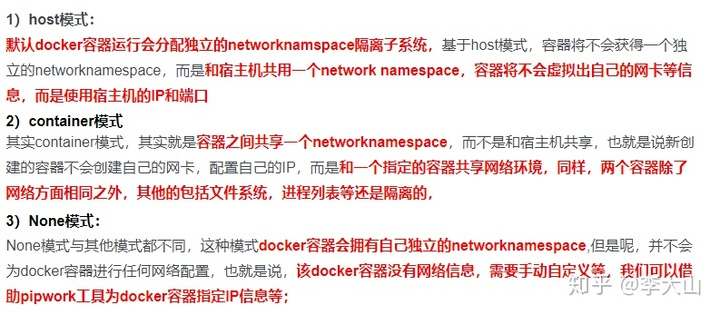

##### docker 学习笔记-初始

##### 容器技术

容器技术是一种全新意义上的虚拟化技术，按分类或者实现方式来说，其应该属于操作系统虚拟化的范畴，也就是在由操作系统提供虚拟化的支持。
所谓容器技术，指的是操作系统自身支持一些接口，能够让应用程序间可以互不干扰的独立运行，并且能够对其在运行中所使用的资源进行干预
keyword：隔离，独立

##### 容器 VS 虚拟器


容器对比虚拟机少了虚拟操作系统和虚拟机监视器这两个层次，大幅减少了应用程序运行带来的额外消耗，但是由于没有指令转换不能解决程序跨平台兼容的问题。牺牲跨平台兼容问题，提高效率和资源利用。

##### Docker 项目是一个由 Go 语言实现的容器引擎

###### docker能做什么

1. 更快、更一致的交付你的应用程序
  使用 Docker 后，开发者能够在本地容器中得到一套标准的应用或服务的运行环境，由此可以简化开发的生命周期 ( 减少在不同环境间进行适配、调整所造成的额外消耗 )。对于整个应用迭代来说，加入 Docker 的工作流程将更加适合持续集成 ( Continuous Integration ) 和持续交付 ( Continuous Delivery )。
    举个具体的例子：
    * 开发者能够使用 Docker 在本地编写代码并通过容器与其他同事共享他们的工作。
    * 他们能够使用 Docker 将编写好的程序推送至测试环境进行自动化测试或是人工测试。
    * 当出现 Bugs 时，开发者可以在开发环境中修复它们，并很快的重新部署到测试环境中。
    * 在测试完成后，部署装有应用程序的镜像就能完成生产环境的发布。
2. 跨平台部署和动态伸缩
3. 让同样的硬件提供更多的产出能力
Docker 的高效和轻量等特征，为替代基于 Hypervisor 的虚拟机提供了一个经济、高效、可行的方案。在 Docker 下，你能节约出更多的资源投入到业务中去，让应用程序产生更高的效益。同时，如此低的资源消耗也说明了 Docker 非常适合在高密度的中小型部署场景中使用。

##### docker核心组成

1. 镜像（Images）
只读文件包，其中包含了虚拟环境运行最原始文件系统的内容。
增量式镜像结构（Docker 的镜像实质上是无法被修改的，因为所有对镜像的修改只会产生新的镜像，而不是更新原有的镜像）
Docker 镜像其实是由基于 UnionFS 文件系统的一组镜像层依次挂载而得，而每个镜像层包含的其实是对上一镜像层的修改，这些修改其实是发生在容器运行的过程中的。所以可以反过来理解，镜像是对容器运行环境进行持久化存储的结果。
2. 容器（Container）
隔离出来的一种虚拟环境。
3. 网络（Network）
数据交换，容器间建立虚拟网络，将数个容器包裹其中，同时与其他网络环境隔离。
利用一些技术，Docker 能够在容器中营造独立的域名解析环境，这使得我们可以在不修改代码和配置的前提下直接迁移容器，Docker 会为我们完成新环境的网络适配。对于这个功能，我们甚至能够在不同的物理服务器间实现，让处在两台物理机上的两个 Docker 所提供的容器，加入到同一个虚拟网络中，形成完全屏蔽硬件的效果
4. 数据卷（Volume）
Union File System 技术

##### docker安装

1. 镜像源
在 Linux 环境下，我们可以通过修改 \/etc/docker/daemon.json ( 如果文件不存在，你可以直接创建它 ) 这个 Docker 服务的配置文件达到效果。

```json
{
    "registry-mirrors": [
        "https://registry.docker-cn.com"
    ]
}
```

在修改之后，别忘了重新启动 docker daemon 来让配置生效哟：

```bash
sudo systemctl restart docker
```

要验证我们配置的镜像源是否生效，我们可以通过 docker info 来查阅当前注册的镜像源列表。

```bash
sudo docker info
```

2. 直接安装Docker Desktop即可
原理：既然 Windows 和 macOS 中没有 Docker 能够利用的 Linux 环境，创造一个 Linux 环境就！Docker for Windows 和 Docker for Mac 正是这么实现的。

##### docker使用??

* 运行：

```bash
sudo systemctl start docker
```

* Docker 服务开机自启动

```bash
sudo systemctl enable docker
```

##### docker常见命令

```bash
docker info // 查看docker具体实例

docker images // 查看docker所下的镜像

docker pull 镜像名 // 获取镜像

docker search 镜像名 // 通过docker hub里获取镜像

docker inspect 镜像名 // 获取镜像的具体详细信息

docker rmi 镜像名 // 删除镜像
```

##### 容器创建和启动

* Created：容器已经被创建，容器所需的相关资源已经准备就绪，但容器中的程序还未处于运行状态。
* Running：容器正在运行，也就是容器中的应用正在运行。
* Paused：容器已暂停，表示容器中的所有程序都处于暂停 ( 不是停止 ) 状态。
* Stopped：容器处于停止状态，占用的资源和沙盒环境都依然存在，只是容器中的应用程序均已停止。
* Deleted：容器已删除，相关占用的资源及存储在 Docker 中的管理信息也都已释放和移除

##### 容器命令

* 创建容器
docker create --name 名字 镜像名

* 启动容器
docker start name
* docker run 类似于 docker create + docker start，相当于前台运行方式

```
docker run --name nginx -d nginx:1.12 
// -d 或 --detach 这个选项告诉 Docker 在启动后将程序与控制台分离，使其进入“后台”运行
```

* 管理容器
docker ps  // 处于运行中的容器
docker ps -a // 查看所有的容器
* 停止容器
docker stop name
* 删除容器
docker rm name  // -f 代表强制删除运行中的容器，不提倡
* 进入容器1
docker attach name // 用于将当前的输入输出流连接到指定的容器
* 进入容器2
docker exec -i // ( --interactive ) 表示保持我们的输入流，只有使用它才能保证控制台程序能够正确识别我们的命令
docker exec -t // ( --tty ) 表示启用一个伪终端，形成我们与 bash 的交互，如果没有它，我们无法看到 bash 内部的执行结果。
docker exec -it // ( -i 与 -t 简写)
// 后面需要两个参数
ps: docker attach命令stdin的退出也会导致容器的停止，docker exec不会
eg:

```bash
docker exec -it num bash // 进入容器num内部,并以bash方式运行
whereis nginx // nginx 位置
cd /usr/sbin // 到sbin 目录下
./nginx -s stop  // 停止nginx
// 输入流自动被关闭回到控制台
docker ps -a // 查看状态 容器已关闭
```

* -e 参数说明
-e的作用是指定容器内的环境变量。
mysql的镜像中是有一个初始化脚本的，这个脚本会读取这个变量初始化root的密码。
dockerfile中使用ENV指令指定环境变量

##### 网络

###### 容器网络

容器网络实质上也是由 Docker 为应用程序所创造的虚拟环境的一部分，它能让应用从宿主机操作系统的网络环境中独立出来，形成容器自有的网络设备、IP 协议栈、端口套接字、IP 路由表、防火墙等等与网络相关的模块。

容器网络模型的三个核心点：

* 沙盒
提供了容器的虚拟网络栈，也就是之前所提到的端口套接字、IP 路由表、防火墙等的内容。其实现隔离了容器网络与宿主机网络，形成了完全独立的容器网络环境。
* 网络
可以理解为 Docker 内部的虚拟子网，网络内的参与者相互可见并能够进行通讯。Docker 的这种虚拟网络也是于宿主机网络存在隔离关系的，其目的主要是形成容器间的安全通讯环境。
* 端点
端点是位于容器或网络隔离墙之上的洞，其主要目的是形成一个可以控制的突破封闭的网络环境的出入口。当容器的端点与网络的端点形成配对后，就如同在这两者之间搭建了桥梁，便能够进行数据传输了。

###### 网络命令

* 管理网络列表

```bash
docker network ls 
```

 1. host模式：使用 --net=host 指定。
 2. none模式：使用 --net=none 指定。
 3. bridge模式：使用 --net=bridge 指定，默认设置。
 4. container模式：使用 --net=container:NAME_or_ID 指定
 


* 创建网络

```bash
docker network create -d bridge individual
```

通过 -d 选项我们可以为新的网络指定驱动的类型，其值可以是刚才我们所提及的 bridge、host、none

* 暴露端口
--expose

```bash
sudo docker run -d --name mysql -e MYSQL_RANDOM_ROOT_PASSWORD=yes --expose 13306 --expose 23306 mysql:5.7 // 暴露13306 23306端口 在docker ps就能看到
```

###### 容器互联

--link

```
sudo docker run -d --name webapp --link mysql webapp:latest
```

别名链接

```
sudo docker run -d --name webapp --link mysql:database webapp:latest
```

--link \<name>:\<alias> 的形式，连接到 MySQL 容器，并设置它的别名为 database


-------上述我没怎么搞懂，回头再搞一次--------

* 另几种方式
	1. 在容器启动时，启动命令中加入links指定链接的容器:(对应下面的端口映射)
	```
	docker run -itd --name nginx-web02 --link nginx-web:nginx01 -p 81:81 sunmmi/nginx nginx
	```
	run容器nginx-web02时，link容器nginx-web,其中nginx-web：nginx01前面是链接哪个容器名，后面是对这个容器别名.
	2. 也是在容器启动时，启动命令中加入network指定局域网络
		创建一个新的 Docker 网络
		```
		docker network create -d bridge my-net
		```
		运行一个容器并连接到新建的 my-net 网络
		```
		docker run -it --rm --name busybox1 --network my-net busybox sh
		```
		打开新的终端，再运行一个容器并加入到 my-net 网络
		```
		docker run -it --rm --name busybox2 --network my-net busybox sh
		```
		过 ping 来证明 busybox1 容器和 busybox2 容器建立了互联关系
		```
		ping busybox1
		```
		```
		ping busybox2
		```
###### 端口映射

通过 Docker 端口映射功能，我们可以把容器的端口映射到宿主操作系统的端口上，当我们从外部访问宿主操作系统的端口时，数据请求就会自动发送给与之关联的容器端口。
要映射端口，我们可以在创建容器时使用 -p 或者是 --publish 选项。

```
sudo docker run -d --name nginx -p 80:80 -p 443:443 nginx:1.12
```

使用端口映射选项的格式是 -p \<ip>:\<host-port>:\<container-port>，其中 ip 是宿主操作系统的监听 ip，可以用来控制监听的网卡，默认为 0.0.0.0，也就是监听所有网卡。host-port 和 container-port 分别表示映射到宿主操作系统的端口和容器的端口，这两者是可以不一样的，我们可以将容器的 80 端口映射到宿主操作系统的 8080 端口，传入 -p 8080:80 即可。
