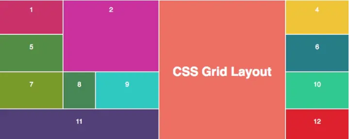

# 网格布局 grid

### 起因

昨天面试的时候，出了一道面试题，模拟面试公司的列表的元素宽度伸缩变化，根据屏幕大小的不同，一行上放置最多的元素，元素宽度不固定，间距固定,可换行，靠左对齐，当时猜出来用flex➕js监听resize来实现，最后发现媒体查询结合grid即可实现，所以今天的重头戏就是 __grid__

### 定义

grid 是一种布局方案，css3的一种属性，叫网格布局，它将网页划分成一个个网格，可以任意组合的网格
类似于弹性布局flex，flex是一维布局，grid是二维布局，有纵向也有横向
网格容器是决定将网格分为几行几列
用途，举个例子：

根据这个示例，如果按照平时写法，会嵌套很多div进行布局，而grid的出现，就是为了解决这个布局

### 概念介绍

#### 声明方式

1. display: grid
  指定容器使用网格布局

2. display: inline-grid
  指定容器设为行内元素并使用网格布局

两者的区别：

  1. display: grid默认情况下，元素会独占一行，并且如果有多个元素，则会按顺序从左到右排列（比如说，一行上每个元素等比展示，正好布满一行）
  2. display: inline-grid 元素会根据内容进行自动调整大小，并与其他行内元素在同一行中排列（比如说，一行上每个元素的宽度取决于其中某个元素最长的宽度，并不一定布满一行）
  

注意：__只是声明这一个属性，也不会生效__ 因为display: grid的声明只创建了一个只有一列的网格，所以你的子项还是会像正常布局流那样从上而下一个接一个的排布，需要使用一些属性，才能变成网格

#### 定义

1. 网格容器
当一个元素的属性设置为display：grid时， 它是所有网格项（Grid Items）的直接父元素,比如下面的con

    ```html
    <div class="con">
      <div class="item"></div>
      <div class="item"></div>
      <div class="item"></div>
    </div>
    ```

2. 网格项
网格容器的子节点元素。这里 item元素都是网格项，但是sub-item不包含其中
__说明，网格项只存在于父子之间的关系，不存在祖孙的关系__

    ```html
    <div class="con">
      <div class="item"></div>
      <div class="item"></div>
      <div class="item">
        <div class="sub-item"></div>
      </div>
    </div>
    ```

3. 网格列 column
网格项的垂直线被称为列

4. 网格行 row
网格项的水平线被称为行。

5. 网格间隙
每列/行之间的间隔


#### 属性介绍

##### 容器属性

容器属性，顾名思义就是作用于容器上的，就是声明display:grid的标签上的属性

1. __grid-template-columns__
网格布局中的列数，并可定义每列的宽度，该值是以空格分隔的列表，其中每个值定义相应列的长度。

    ```css
    .con{
      display: grid;
      /* 按照固定宽度分配（px,rem,em,pt） */
      grid-template-columns: 100px 200px 300px 400px; 
      /* 将根据内容的大小自动调整。这意味着网格项将根据其内部的内容来决定宽度，并自动适应不同内容的大小 */
      grid-template-columns: auto auto auto auto;
      /* 相对单位，表示剩余空间的分数 */
      grid-template-columns: 1fr 1fr 1fr 1fr;
      /* 相对于父元素的宽度 */
      grid-template-columns: 20% 30% 40% 30%;
      /* 第一个列宽度为 100px，第二个列宽度为父元素宽度的 20%，第三个列宽度为 200px，第四个列将根据内容自动调整  */
      grid-template-columns: 100px 20% 200px auto;
      /* 第一列宽度为100px,第二列为剩余宽度的2/3，第三列为固定宽度200px；第四列为剩余宽度的1/3 */
      grid-template-columns: 100px 2fr 200px 1fr;
      /* !!!!!!! 1fr代表就一列，个数代表有几列 */
      grid-template-columns: 1fr;
      /* 有两列 */
      grid-template-columns: 1fr 1fr;
      /* 重复创建三个等1fr的列 */
      grid-template-columns: repeat(3, 1fr);
      /* 重复创建三个等200px的列 */
      grid-template-columns: repeat(3, 200px);
      /* 同上 */
      grid-template-columns: auto;
      grid-template-rows: auto;
    }
    ```

2. __grid-template-rows__
网格布局中的行数，定义每列的高度，同理，该值是以空格分隔的列表，其中每个值定义相应列的高度。
例子和grid-template-columns一样，略有不同，当元素没有那么多时，高度会固定，下边会有空白

    ```css
    .con{
      display: grid;
      grid-template-columns: 1fr 1fr;
      /* 按照固定高度分配（px,rem,em,pt） */
      grid-template-rows: 100px 200px 300px 400px; 
      /* 将根据内容的高度自动调整。这意味着网格项将根据其内部的内容来决定高度 */
      grid-template-rows: auto auto auto auto;
      /* 根据内容高度 */
      grid-template-rows: 1fr 1fr 1fr 1fr;
      /* 第二行将会比其他行略高，因为它占据了剩余空间的 2/5。其他行将均分剩余空间的 1/5 */
      grid-template-rows: 1fr 2fr 1fr 1fr;
      /* 相对于父元素的高度对其进行分配 */
      grid-template-rows: 20% 30% 40% 30%;
      /* 第一个列高度为 100px，第二个列高度为父元素高度的 20%，第三个列高度为 200px，第四个列将根据内容自动调整 */
      /* 有溢出的情况，主要原因是如果网格项的高度使用百分比进行定义，则该百分比是相对于其父容器的高度计算的。如果父容器的高度没有明确设置或是受到其他因素的影响，可能导致计算出的高度与预期不符，从而导致溢出 */
      grid-template-rows: 100px 20% 200px auto;
      /* 第一列高度为100px,第二列为剩余高度的2/3，第三列为固定高度200px；第四列为剩余高度的1/3 */
      /* 重复创建三个等1fr的行 */
      grid-template-rows: repeat(3, 1fr);
      /* 重复创建三个等200px的行 */
      grid-template-rows: repeat(3, 200px);
      grid-template-rows: 100px 2fr 200px 1fr;
    }
    ```

3. __justify-content__
在网格容器内对齐整个网格，和flex的justify-content意思一样，不过多了个space-evenly

    ```css
    .con{
      display: grid;
      /* 注意！！！！1fr为单位的无法生效 */
      grid-template-colums: 20% 20% 20%;
      grid-template-rows: auto;
      /* 网格项在主轴的末尾位置对齐 */
      justify-content: end;
      /* 默认值 */
      /* 网格项在主轴的起始位置对齐 */
      justify-content: start;
      /* 网格项在主轴的中间位置对齐 */
      justify-content: center;
      /* 网格项在主轴上均匀分布，并且两个网格项之间有相等的空间，而第一个网格项和最后一个网格项与容器的边缘之间的空间是其他网格项间隔的两倍 */
      justify-content: space-around;
      /* 网格项在主轴上均匀分布，并且第一个网格项在容器的起始位置，最后一个网格项在容器的末尾位置 */
      justify-content: space-between;
      /* 网格项在主轴上均匀分布，并且网格项之间的空间相等 */
      justify-content: space-evenly;
    }
    ```

4. __align-content__
用于垂直对齐容器内的整个网格，和flex的align-items一样

    ```css
    .con{
      display: grid;
      /* 注意！！！！1fr为单位的无法生效 */
      height: 800px;
      grid-template-colums: 20%;
      grid-template-rows: 10px 20px 30px;
      /* 网格行在交叉轴的起始位置对齐 */
      align-content: start;
      /* 网格行在交叉轴的末尾位置对齐 */
      align-content: end;
      /* 网格行在交叉轴上居中对齐 */
      align-content: center;
      /* 网格行在交叉轴上均匀分布，并且第一行在容器的起始位置，最后一行在容器的末尾位置 */
      algin-content: space-between;
      /* 网格行在交叉轴上均匀分布，并且两个网格行之间有相等的空间，而第一行和最后一行与容器的边缘之间的空间是其他网格行间隔的两倍 */
      align-content: space-around;
      /* 网格行在交叉轴上均匀分布，并且网格行之间的空间相等 */
      align-content: space-evenly;
      /* 默认值，网格行会沿交叉轴拉伸以填充整个网格容器的高度 */
      align-content: stretch;
    }
    ```

5. __grid-column-gap__
设置列之间的间隙

    ```css
    .con{
      display: grid;
      grid-template-columns: 1fr 1fr 1fr;
      grid-column-gap: 20px;
    }
    ```

6. __grid-row-gap__
设置行之间的间隙

    ```css
    .con{
      display: grid;
      grid-template-column: 1fr 1fr 1fr;
      grid-template-rows: 1fr 1fr 1fr;
      grid-row-gap: 20px;
    }
    ```

7. __grid-gap__
设置行列的间隙 grid-row-gap grid-column-gap的缩写，注意顺序

    ```css
    .con{
      display: grid;
      grid-template-column: 1fr 1fr 1fr;
      grid-template-rows: 1fr 1fr 1fr;
      /* 行列都是20px的间隙 */
      grid-gap: 20px;
      /* 行为20px的间隙，列为30px的间隙 */
      grid-gap: 20px 30px;
    }
    ```

8. __grid-template-areas__
高级技巧
以可读性强的方式指定网格项的位置。你可以通过使用字符串来为每个网格区域命名，并使用这些命名来描述整个布局。这个属性只能在网格容器上使用
使用 grid-template-areas，你可以为每个网格项指定一个名称，并使用这些名称来创建一个网格布局模板。每个字符串表示一个网格行，在字符串中使用空格或点号 (.) 来表示每个网格单元格的位置

    ```css
    .item1 { grid-area: header; }
    .item2 { grid-area: menu; }
    .item3 { grid-area: main; }
    .item4 { grid-area: right; }
    .item5 { grid-area: footer; }

    .grid-container {
      display: grid;
      grid-template-columns: repeat(6, 1fr);
      grid-template-areas:
        'header header header header header header'
        'menu main main main right right'
        'menu footer footer footer footer footer';
      grid-gap: 10px;
      background-color: #2196F3;
      padding: 10px;
    }

    .grid-container > div {
      background-color: rgba(255, 255, 255, 0.8);
      text-align: center;
      padding: 20px 0;
      font-size: 30px;
    }
    ```

注意点：

1. 网格项不能跨越命名区域：在一个命名区域中，不能将同一个网格项跨越多个网格单元格。如果需要创建跨越多个网格单元格的网格项，可以考虑使用 grid-row-start、grid-column-start、grid-row-end 和 grid-column-end 或 grid-area 来指定跨越的行和列的范围
2. 网格项名称和网格模板的定义应保持一致：在网格模板中指定的网格项名称必须与你在网格容器中的子元素选择器中使用的名称一致。否则，布局模板将无法正确应用到网格项上
3. 使用相同数量的格子来定义每一行：在网格模板中，每行的格子数量应该一致。否则，会导致网格项在布局中无法正确对应，造成不符合预期的布局结果
4. 排列顺序和大小要一致：在网格模板中，不同的网格项名称代表不同的区域。确保网格项名称在模板中的排列顺序和大小与实际布局中的要求一致。这样可以确保网格项被正确地分配到相应的区域
5. 使用点号占位：如果有某个区域不需要被任何网格项占据，可以使用点号 (.) 来占位。这有助于确保网格模板布局的正确性()

##### 项目属性

项目属性，就是作用于项目上的属性
__所有的线（行/列）都是从1开始算__

1. __grid-column-start/grid-column-end__
在一列上，从左到右，从start开始到end结束，类似于截断
它接受一个整数值或一个命名网格线（line name）作为参数
eg: 当网格项的起始列位置大于网格容器的列数时，网格项将自动跨越多个列

    ```css
    .con{
      display: grid;
      grid-template-columns: 1fr 1fr 1fr 1fr;
    }
    .item>div{
      padding: 10px;
      border: 1px solid;
    }
    .item:first-child{
      /* 这代表在一列中，从第一个开始到第三个作为这个元素的容器大小 */
      grid-columns-start: 1;
      grid-columns-end: 3;
    }
    .item:first-child{
      /* 这代表在一列中，若没有start，end为3代表从 ？？？ */
       /* 捉摸不透 */
      grid-columns-end: 3;
    }
    .item:first-child{
      /*这代表在一列中，当网格项的起始列位置大于网格容器的列数时，网格项将自动跨越多个列？？？  */
      /* 捉摸不透 */
      grid-columns-start: 4;
      grid-columns-end: 3;
    }
    .item:first-child{
      /* 在这一列中，代表从第二列之前的给隔出来，不合并，给空出来，可以看例子可知 */
      /* 当列数大于网格列树时，最后一个会缩小 */
      grid-columns-start: 2;
    }
    .item:nth-child(2){
      /* 这个代表从第二列开始计算 */
      grid-column-start: 1;
      grid-column-end: 3;
    }
    .item:nth-child(2){
      /* 也是从第二列开始，因为在第一列截取的宽度不够，从第二列开始 */
      grid-column-start: 1;
      grid-column-end: 4;
    }
    ```

__eg: 无效设置，最好不要这么弄，我也没搞清楚怎么回事，后续再补充__
2. __grid-column__
定义将项目放置在哪一列上。您可以定义项目的开始位置以及结束位置.
grid-column 属性是 grid-column-start 和 grid-column-end 属性的简写属性

```css
  .con{
    display: grid;
    grid-template-columns: 1fr 1fr 1fr 1fr;
  }
  .item>div{
    padding: 10px;
    border: 1px solid;
  }
  .item:first-child{
    /* 这代表在一列中，从第一个线开始到第三个线作为这个元素的容器大小 */
    grid-columns: 1 / 3;
  }
  .item:first-child{
    /* 这代表在一列中，从第一个开始，横跨三列，就到第四个线的容器 */
    grid-columns: 1 / span 3;
  }
```

3. __grid-row-start/grid-row-end__
在一行上，从上到下，从start开始到end结束

```css
  .con{
    display: grid;
    grid-template-row: 1fr 1fr 1fr 1fr;
  }
  .item>div{
    padding: 10px;
    border: 1px solid;
  }
  .item:first-child{
    /* 这代表在一列中，从第一个线开始到第三个线作为这个元素的容器大小 */
    grid-rows-start: 1;
    grid-rows-end: 3
  }
```

4. __grid-row__
定义了将项目放置在哪一行
grid-row 属性是 grid-row-start 和 grid-row-end 属性的简写属性。
如需放置项目，您可以引用行号，或使用关键字 “span” 定义该项目将跨越多少行

    ```css
    .con{
      display: grid;
      grid-template-rows: 1fr 1fr 1fr 1fr;
    }
    .item>div{
      padding: 10px;
      border: 1px solid;
    }
    .item:first-child{
      /* 这代表在一行中，从第一个线开始到第三个线作为这个元素的容器大小 */
      grid-rows: 1 / 3;
    }
    .item:first-child{
      /* 这代表在一行中，从第一个开始，横跨三行，就到第四个线的容器 */
      grid-rows: 1 / span 3;
    }
    ```

5. grid-area
grid-area 属性可以用作 grid-row-start、grid-column-start、grid-row-end 和 grid-column-end 属性的简写属性

    ```css
    .item:nth-child(3){
      /* 从第一行线，第二列线开始 到 第三行线，第四列线结束 */
      grid-area: 1 / 2 / 3 / 4
    }
    .item:nth-child(3){
      /* 从第2行线，第二列线开始 到 横化三行线，第四列线结束 */
      grid-area: 2 / 2 / span 3 / 4
    }
    ```

### 总结

网格布局功能较多，想要完全理解必须得实践才能明白其原理，这次笔记整理不是很全，有些部分很懵懂，需要下去再进去做demo进行练习。

### 参考资料

[https://www.w3school.com.cn/css/css_grid.asp](https://www.w3school.com.cn/css/css_grid.asp)
