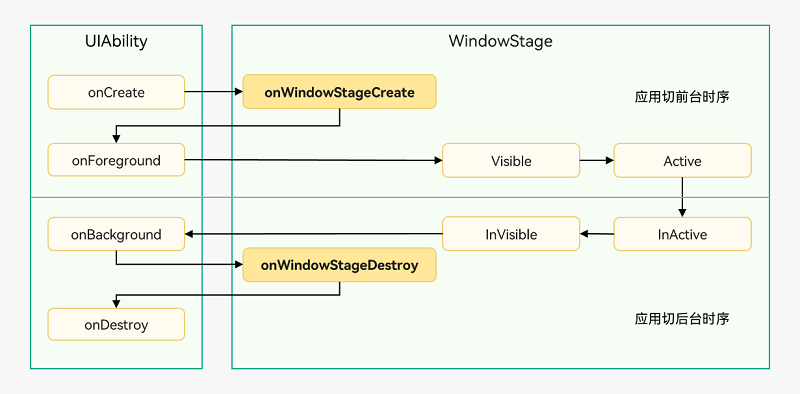

## UlAbility

在module.json5配置文件的abilities标签中声明UIAbility的名称、入口、标签等相关信息

### 概述

__UIAbility组件是一种包含UI界面的应用组件__，主要用于和用户交互。

UIAbility组件是系统调度的基本单元，为应用提供绘制界面的窗口；一个UIAbility组件中可以通过多个页面来实现一个功能模块。每一个UIAbility组件实例，都对应于一个最近任务列表中的任务。

可以理解为UlAbility就是一个软件，举个例子，在桌面打开一个图库/相册，里面的图片以及多选，删除等等就是UlAbility要做的。

入口有三种：

1. 点击桌面进入应用
2. 一个应用拉起另一个应用
3. 最近任务列表切回应用

### 生命周期

 

对应的四个钩子函数：

```ets
import UIAbility from '@ohos.app.ability.UIAbility';
import Window from '@ohos.window';

export default class EntryAbility extends UIAbility {
    onCreate(want, launchParam) {
        // 应用初始化
    }
    onWindowStageCreate(windowStage: Window.WindowStage) {
        // 设置WindowStage的事件订阅（获焦/失焦、可见/不可见）

        // 设置UI界面加载
        windowStage.loadContent('pages/Index', (err, data) => {
            // ...
        });
    }
    onWindowStageDestroy() {
        // 释放UI界面资源
    }
    onForeground() {
        // 申请系统需要的资源，或者重新申请在onBackground中释放的资源
    }

    onBackground() {
        // 释放UI界面不可见时无用的资源，或者在此回调中执行较为耗时的操作
        // 例如状态保存等
    }
    onDestroy() {
        // 系统资源的释放、数据的保存等
    }
}
```

1. onCreate
   Create状态为在应用加载过程中，UIAbility实例创建完成时触发，系统会调用onCreate()回调。可以在该回调中进行应用初始化操作，例如变量定义资源加载等，用于后续的UI界面展示
2. onForeground
   onForeground()回调，在UIAbility的UI界面可见之前，如UIAbility切换至前台时触发。可以在onForeground()回调中申请系统需要的资源，或者重新申请在onBackground()中释放的资源
   eg: 例如应用在使用过程中需要使用用户定位时，假设应用已获得用户的定位权限授权。在UI界面显示之前，可以在onForeground()回调中开启定位功能，从而获取到当前的位置信息
3. onBackground
   onBackground()回调，在UIAbility的UI界面完全不可见之后，如UIAbility切换至后台时候触发。可以在onBackground()回调中释放UI界面不可见时无用的资源，或者在此回调中执行较为耗时的操作，例如状态保存等
   eg:当应用切换到后台状态，可以在onBackground()回调中停止定位功能，以节省系统的资源消耗
4. onDestroy
   Destroy状态在UIAbility实例销毁时触发。可以在onDestroy()回调中进行系统资源的释放、数据的保存等操作
   例如调用terminateSelf()方法停止当前UIAbility实例，从而完成UIAbility实例的销毁；或者用户使用最近任务列表关闭该UIAbility实例，完成UIAbility的销毁
5. onWindowStageCreate
   UIAbility实例创建完成之后，在进入Foreground之前，系统会创建一个WindowStage。WindowStage创建完成后会进入onWindowStageCreate()回调，可以在该回调中设置UI界面加载、设置WindowStage的事件订阅
6. onWindowStageDestroy
   在UIAbility实例销毁之前，则会先进入onWindowStageDestroy()回调，可以在该回调中释放UI界面资源。例如在onWindowStageDestroy()中注销获焦/失焦等WindowStage事件

### 启动模式

在module.json5配置文件中的"launchType"字段对应的。

1. singleton
   singleton启动模式为单实例模式，也是默认情况下的启动模式
   每次调用startAbility()方法时，如果应用进程中该类型的UIAbility实例已经存在，则复用系统中的UIAbility实例。系统中只存在唯一一个该UIAbility实例，即在最近任务列表中只存在一个该类型的UIAbility实例
2. multiton
   multiton启动模式为多实例模式，每次调用startAbility()方法时，都会在应用进程中创建一个新的该类型UIAbility实例。即在最近任务列表中可以看到有多个该类型的UIAbility实例
3. Specified

### 用法

1. 指定UIAbility的启动页面
   应用中的UIAbility在启动过程中，需要指定启动页面，否则应用启动后会因为没有默认加载页面而导致白屏。可以在UIAbility的onWindowStageCreate()生命周期回调中，通过WindowStage对象的loadContent()方法设置启动页面。

2. 获取UIAbility的上下文UlAbilityContext

   1. 在UIAbility中可以通过this.context获取UIAbility实例的上下文信息

   2. 在页面中获取UIAbility实例的上下文信息，包括导入依赖资源context模块和在组件中定义一个context变量两个部分

      ```ets
      import common from '@ohos.app.ability.common';
      
      @Entry
      @Component
      struct Index {
        private context = getContext(this) as common.UIAbilityContext;
      
        startAbilityTest() {
          let want = {
            // Want参数信息
          };
          this.context.startAbility(want);
        }
      
        // 页面展示
        build() {
          // ...
        }
      }
      ```

### UlAbility组件与UI的数据同步

1. EventHub

   ```ets
   import UIAbility from '@ohos.app.ability.UIAbility';
   export default class EntryAbility extends UIAbility{
    onCreate(want, launch) {
           // 获取eventHub
           let eventhub = this.context.eventHub;
           // 执行订阅操作
           eventhub.on('event1', (...data) => {
               // 触发事件，完成相应的业务操作
               console.info(JSON.stringify(data));
           });
       }
   }
   ```

   ```ets
   import common from '@ohos.app.ability.common';
   
   @Entry
   @Component
   struct Index {
     private context = getContext(this) as common.UIAbilityContext;
   
     eventHubFunc() {
       this.context.eventHub.emit('event1', 2, 'test');
     }
   
     // 页面展示
     build() {
       // ...
     }
   }
   ```

2. globalThis
   globalThis既可以UIAbility组件与UI数据同步，也可以UIAbility组件与UIAbility组件数据同步

3. AppStorage/LocalStorage
