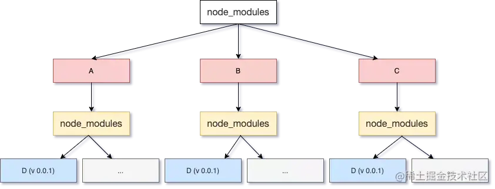
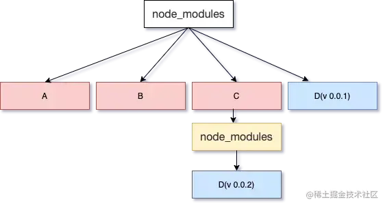
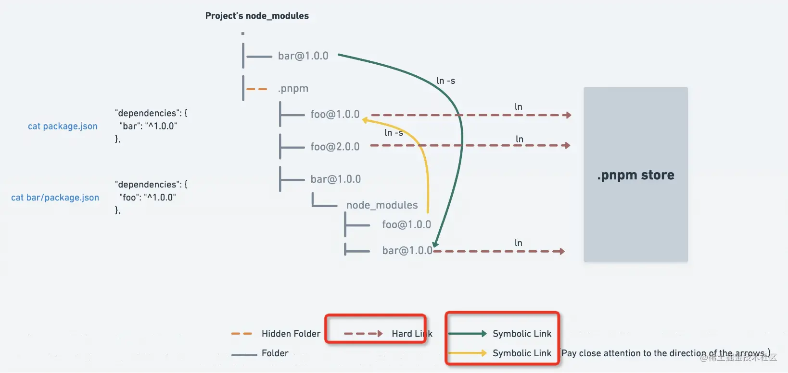

## npm与yarn，pnpm的区别

### 引言
经常在网上看到pnpm怎么怎么好使，火了一段时间，当时想着pnpm与npm和yarn有什么区别，故这次整理下笔记记录

#### npm
##### npm2
npm2在安装依赖包时，采用递归安装方法。执行npm install后，npm根据dependencies和devDependencies属性中指定的包来确定第一层依赖，npm2会根据第一层依赖的子依赖，递归安装各个包到子依赖的 node_modules 中，直到子依赖不再依赖其他模块。执行完毕后，我们会看到 ./node_modules 这层目录中包含有我们 package.json 文件中所有的依赖包，而这些依赖包的子依赖包都安装在了自己的 node_modules 中 ，形成递归树形的依赖树结构。

优点：
​1. 层级结构非常明显，可以清楚的在第一层的 node_modules 中看到我们安装的所有包的子目录；
​2. 在已知自己所需包的名字以及版本号时，可以复制粘贴相应的文件到 node_modules 中，然后手动更改 package.json 中的配置；
​3. 如果想要删除某个包，只需要简单的删除 package.json 文件中相应的某一行，然后删除 node_modules 中该包的目录；

缺点：
1. 假设A，B，C 三个包中有相同的依赖 D 时，执行 npm install 后，D 会被重复下载三次，而随着我们的项目越来越复杂，node_modules 中的依赖树也会越来越复杂，像 D 这样的包也会越来越多，造成了大量的冗余
2. 在 windows 系统中，甚至会因为目录的层级太深导致文件的路径过长，触发文件路径不能超过 280 个字符的错误

##### npm3及以上
npm 3 会遍历所有的节点，逐个将模块放在 node_modules 的第一层，当发现有重复模块时，则丢弃， 如果遇到某些依赖版本不兼容的问题，则继续采用 npm 2 的处理方式，前面的放在 node_modules 目录中，后面的放在依赖树中。

优点：
1. 采用平铺安装模块，减少了重复模块

缺点：
1. 还是未解决冗余问题
2. 当每个模块依赖都相同时会打乱顺序

#### yarn
上面说 npm2 的 node_modules 是嵌套的。
这样其实是有问题的，多个包之间难免会有公共的依赖，这样嵌套的话，同样的依赖会复制很多次，会占据比较大的磁盘空间。
这个还不是最大的问题，致命问题是 windows 的文件路径最长是 260 多个字符，这样嵌套是会超过 windows 路径的长度限制的。
yarn的解决方式：铺平。所有的依赖不再一层层嵌套了，而是全部在同一层，这样也就没有依赖重复多次的问题了，也就没有路径过长的问题了。但也会有嵌套情况，因为一个包是可能有多个版本的，提升只能提升一个，所以后面再遇到相同包的不同版本，依然还是用嵌套的方式。

缺点：
1. 依赖结构的不确定性。（yarn.lock/packjson.lock已解决这个问题）
2. 扁平化算法本身的复杂性很高，耗时较长。
3. 项目中仍然可以非法访问没有声明过依赖的包(幽灵依赖：明明没有声明在 dependencies 里的依赖，但在代码里却可以 require 进来)

#### pnpm
首先介绍下 link，也就是软硬连接，这是操作系统提供的机制，硬连接就是同一个文件的不同引用，而软链接是新建一个文件，文件内容指向另一个路径。当然，这俩链接使用起来是差不多的。
如果不复制文件，只在全局仓库保存一份 npm 包的内容，其余的地方都 link 过去呢？
这样不会有复制多次的磁盘空间浪费，而且也不会有路径过长的问题。因为路径过长的限制本质上是不能有太深的目录层级，现在都是各个位置的目录的 link，并不是同一个目录，所以也不会有长度限制。
pnpm 就是通过这种思路来实现的
所有的依赖都是从全局 store 硬连接到了 node_modules/.pnpm 下，然后之间通过软链接来相互依赖。

优点：
1. 快速：通过链接的方式而不是复制
2. 节省磁盘空间，一个包全局只保存一份，剩下的都是软硬连接
3. 支持单体仓库 
4. 权限严格

#### 参考资料
[pnpm 是凭什么对 npm 和 yarn 降维打击的](https://juejin.cn/post/7127295203177676837)
[pnpm](https://www.pnpm.cn/)