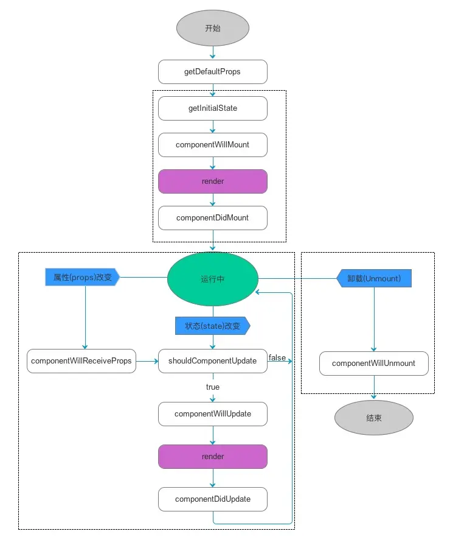

# react基本知识学习

### react的特性

1. 组件化开发: React 的核心思想之一是将应用程序拆分为独立、可重用的组件，有助于编写组织清晰、易于测试的代码。

2. 虚拟 DOM：React 使用虚拟 DOM（Virtual DOM）技术来尽可能地减少对实际 DOM 的操作，从而提高应用性能。

3. 单向数据流：React 的数据流动是单向的，从父组件通过 props 传递给子组件，并且 React 中通常使用不可变数据的概念来确保数据的一致性。

4. JSX 语法：React 使用类似 XML 的语法扩展，叫做 JSX ，允许开发者将 HTML 和 JavaScript 混合编写，使得 UI 代码更简洁、易读、易维护。

5. React Hooks: 是 React 16.8 版本新增的特性，可以在函数组件中使用 React state 、生命周期等特性，使函数组件达到类组件的能力。

6. 强大的生命周期函数：React 提供了组件的生命周期方法（生命周期函数），方便开发者进行组件的初始化、渲染、更新、卸载等操作。

7. 丰富的开发工具：React 社区为 React 开发提供了许多开发工具，如 React Developer Tools、 Redux DevTools 等插件，用于辅助开发者进行开发、调试、测试等工作。

8. 支持服务端渲染：React 应用程序可以在服务器端渲染（Server-Side Rendering） ，提供更快的加载速度、更好的 SEO 支持。

### react原理

react是通过组件的状态和虚拟dom比较的方式实现的，当状态发生变化时，React 会重新渲染只有发生变化的部分，从而提高性能。这种基于状态更新和虚拟 DOM 的比较是 React 的核心机制，保证了组件的高效更新和视图的响应性。单向数据流。

### react新版和旧版的区别

1. 引入了 Hooks：
React 16.8 引入了 Hooks，这是一个基于函数组件的新特性，允许开发者在不编写类组件的情况下使用状态和其他 React 特性。Hooks 提供了一种更简洁、灵活的方式处理组件状态和副作用。

2. 函数组件的强化：
新版 React 更强调函数式组件，将函数组件与 Hooks 结合使用，使得函数组件能够拥有类似于类组件的功能，包括状态管理、生命周期等。

3. 严格模式：
React 新版引入了严格模式（Strict Mode），用于帮助开发者发现一些潜在的问题，例如弃用的生命周期方法、遗留的 API 使用等。

4. Fiber 架构：
React 16 引入了 Fiber 架构，这是一个重写和重新设计的内部实现，旨在改善 React 的渲染和调度能力，使得更好地支持异步渲染和性能优化。

5. Fragments：
React 新版引入了 Fragments，它允许开发者在不引入多余 DOM 元素的情况下，组合多个子元素。

6. Context API 改进：
React 新版对 Context API 进行了改进，提供了更好的性能和更简单的使用方式。

7. Suspense 和 lazy：
React 新版引入了 Suspense 和 lazy，这些特性使得异步加载组件变得更加简单。

8. 一些生命周期方法的更改：
React 16 标记了一些生命周期方法为弃用，并引入了一些新的生命周期方法，以更好地管理组件的行为

### react的生命周期

react的生命周期一般都经历组件初始化，组件更新，组件销毁这三大流程

#### 旧版

  1. __componentWillMount__
    在组件将要被挂载到 DOM 上之前调用，可以在此方法中执行一些准备工作。
  2. __componentDidMount__
    在组件初次渲染完成后调用，可以在此方法中执行一些需要 DOM 完成渲染的操作，如 Ajax 请求等
  3. __componentWillReceiveProps(nextProps)__
    在组件接收到新的 props 时调用，可以在此方法中根据接收到的新 props 更新组件的状态
  4. __shouldComponentUpdate(nextProps, nextState)__
    在组件接收到新的 props 或者状态发生改变时调用，可以通过返回布尔值来控制组件是否需要重新渲染，默认返回 true
  5. __componentWillUpdate(nextProps, nextState)__
    在组件将要被重新渲染前调用，可以在此方法中执行一些更新前的准备工作
  6. __componentDidUpdate(prevProps, prevState)__
    在组件重新渲染完成后调用，可以在此方法中执行一些需要 DOM 完成渲染的操作，如更新其他库（如 jQuery）所管理的 DOM
  7. __componentWillUnmount__
    在组件将要被卸载和销毁前调用，可以在此方法中清理组件使用的资源，如取消定时器、取消订阅等
  8. __componentDidCatch(error, info)__
    在组件的子组件发生错误时调用，可以在此方法中捕获错误并进行错误处理


#### 新版（16.0以上）类组件方式

  新版中取消了componentWillMount，componentWillReceiveProps，componentWillUpdate这三个钩子函数，打上了unsafe标识，并且采用新的钩子函数

  1. __constructor(props)__
    在组件被实例化时调用，用于初始化组件的状态和绑定方法，注意：构造函数中不应执行副作用或订阅事件
  2. __static getDerivedStateFromProps(nextProps, prevState)__
    当组件收到新的 props 时调用，用于根据传入的 props 计算并返回新的 state，注意：这是一个静态方法，不应直接访问组件实例的属性
  3. __render()__
    渲染方法，用于返回组件的 React 元素渲染方法，用于返回组件的 React 元素
  4. __componentDidMount()__
    在组件挂载后调用，通常用于执行副作用操作（如数据获取、订阅事件等）或初始化第三方库
  5. __shouldComponentUpdate(nextProps, nextState)__
    在组件接收到新的 props 或 state 时调用，用于决定是否重新渲染组件，可以根据当前的 props 和 state 与下一个传入的 props 和 state 进行比较，返回 true 或 false
  6. __getSnapshotBeforeUpdate(prevProps, prevState)__
    在组件更新前调用，返回一个值作为 componentDidUpdate 方法的第三个参数，可以在此方法中读取 DOM 元素的信息，如滚动位置，在 componentDidUpdate 中进行恢复
  7. __componentDidUpdate(prevProps, prevState, snapshot)__
    在组件更新后调用，通常用于处理更新后的副作用操作，可以在此方法中进行网络请求、订阅事件等
  8. __componentWillUnmount()__
    在组件即将卸载前调用，用于执行一些清理工作，如清除定时器、取消订阅等
  9. __static getDerivedStateFromError(error)__
    当组件的子组件抛出错误时调用，用于捕获错误并返回一个新的 state
  10. __componentDidCatch(error, info)__
    当组件的子组件抛出错误时调用，用于记录错误信息和进行错误处理


#### 新版 函数组件方式

  1. __useState__
    用于在函数组件中定义和更新状态。替代了传统 class 组件中的 state 属性和 setState 方法
  2. __useEffect__
    用于处理副作用操作，如数据获取、订阅事件、DOM 操作等，替代了传统 class 组件中的 componentDidMount、componentDidUpdate 和 componentWillUnmount 方法
  3. __useCallback__
    用于缓存回调函数，避免不必要的重新创建
  4. __useRef__
    用于在函数组件中引用 DOM 元素或保存任意可变值
  5. __useContext__
    用于在组件中访问 React 上下文。它接收一个上下文对象并返回该上下文的当前值
  6. __useMemo__
    用于缓存计算结果，避免不必要的重复计算

### react的diff算法

React 会检查组件的 key 属性值，用于确定是否同一个组件（通过 key 的一致性）
React 使用 diff 算法来逐层对比两个 Virtual DOM 树的节点。
Diff 算法会优先比较同级的节点，而不会跨级别比较，

1. 更新相同类型的组件：如果两个节点的类型相同，React 会更新该节点的属性和状态（如果有变化）。
2. 替换不同类型的组件：如果两个节点的类型不同，React 会将旧的节点替换为新的节点。这意味着旧组件的状态会被销毁，新组件会重新创建。
3. 递归比较子节点：如果两个父节点的类型相同，React 会对比它们的子节点。React 会在子节点列表中寻找相同的 key 值，以确定需要进行更新或替换的子节点。
4. 对比顺序：React 会尽可能地复用已有的节点，而不是直接销毁和重新创建，以提高性能

### react的fiber

传统的 React 渲染是基于递归的深度优先算法，它在进行组件渲染时，会一直递归到底层的子组件，直到渲染完整棵组件树。这种方式存在一个问题，就是如果组件树很大，渲染时间较长，会导致页面卡顿，用户体验不好。

React Fiber 是 React 16 版本引入的一种新的调和机制，用于改进 React 的渲染方式，使其更加高效且具有更好的用户体验。Fiber 的目标是实现增量渲染，将渲染任务分割成多个小任务，可以中断、恢复和优先级调度，以达到更好的性能。

Fiber 的核心思想是将递归渲染改为迭代渲染，并引入了一种叫做 Fiber 的数据结构，这是一个轻量级的 JavaScript 对象，用于描述组件树的结构信息和渲染任务

Fiber 架构的主要特点包括：

1. 任务切片：将大的渲染任务拆分成小的任务单元，每个任务单元被称为一个 Fiber 节点。
2. 调度优先级：Fiber 节点可以分配优先级，分为高优先级、普通优先级和低优先级。这样可以确保高优先级的任务优先执行，提升用户响应速度和流畅度。
3. 异步渲染：Fiber 架构中，渲染任务可以被中断和恢复。这样可以在浏览器空闲或用户操作时，优先处理重要的交互事件，提升用户体验。
4. 渲染阶段划分：Fiber 将渲染过程划分为不同的阶段，每个阶段有自己的任务类型和优先级。可以根据优先级和任务类型灵活调度任务。
5. 双缓存：Fiber 使用双缓存技术，在内存中维护两个 Fiber 树结构，一个当前正在显示的 Fiber 树（Current Fiber Tree）和一个用于计算的新的 Fiber 树（Work In Progress Fiber Tree）。通过比较这两颗树的差异，可以高效地更新组件。

### react的setState的机制

组件的 state 属性是只读的，只能通过 setState() 方法来修改。setState() 是一个异步的方法，用于告诉 React 需要更新组件的状态，并触发一次重新渲染。setState() 方法的调用有两个作用：一是更新组件状态，二是告诉 React 需要重新渲染组件
setState() 方法的机制如下：

1. 将参数传递给 setState() 方法，React 会将其合并为一个对象，与原来的 state 合并成一个新的 state 对象
2. React 会根据新的 state 对象计算出需要更新的组件，确定哪些组件需要重新渲染
3. React 会将需要重新渲染的组件加入更新队列，等待更新
4. React 会根据更新队列中组件的优先级和更新的位置，分成一定数量的批次进行更新。这里优先级由多个因素决定，如是否是用户交互触发的更新、是否是首次渲染等
5. 每次批次中，React 会对批次中的组件进行渲染，并将渲染结果更新到 DOM 中

需要注意的是，由于 setState() 是异步方法，我们无法立即获得更新后的状态。如果需要根据 state 进行操作，请将操作放在 setState() 的回调函数中，以确保在 state 真正更新后再进行操作。也可以使用 componentDidUpdate() 方法，在组件更新后进行操作

```javascript
import React, { Component } from 'react';

class Counter extends Component {
  constructor(props) {
    super(props);
    this.state = {
      count: 0,
      message: ''
    };
  }
  incrementCount = () => {
    this.setState(prevState => ({
      count: prevState.count + 1
    }));
  }
  componentDidUpdate(prevProps, prevState) {
    if (prevState.count !== this.state.count) {
      this.setState({
        message: `Count updated to ${this.state.count}`
      });
    }
  }
  render() {
    return (
      <div>
        <h2>Count: {this.state.count}</h2>
        <h2>{this.state.message}</h2>
        <button onClick={this.incrementCount}>Increment</button>
      </div>
    );
  }
}

export default Counter;
```

在上述例子中，我们增加了一个 message 状态，并在 componentDidUpdate() 方法中判断前一个状态值 prevState.count 与当前状态值 this.state.count 是否发生变化。如果变化了，我们更新 message 状态来展示新的计数器值。

通过将操作放在 componentDidUpdate() 方法中，我们可以确保在状态真正更新之后进行操作。但需要注意的是，在 componentDidUpdate() 方法中更新状态时，要避免无限循环的情况，否则可能会导致组件更新的死循环。因此，务必添加适当的条件判断，以避免不必要的更新

```javascript
import React, { Component } from 'react';
class Counter extends Component {
  constructor(props) {
    super(props);
    this.state = {
      count: 0,
      message: ''
    };
  }
  incrementCount = () => {
    this.setState(prevState => ({
      count: prevState.count + 1
    }), () => {
      this.setState({
        message: `Count updated to ${this.state.count}`
      });
    });
  }
  render() {
    return (
      <div>
        <h2>Count: {this.state.count}</h2>
        <h2>{this.state.message}</h2>
        <button onClick={this.incrementCount}>Increment</button>
      </div>
    );
  }
}
export default Counter;
```

在上述例子中，我们使用了 setState() 方法的第二个参数，它是一个回调函数，在组件状态更新成功后被调用。我们将更新 message 状态的代码放在这个回调函数中执行
通过这种方式，我们可以在状态真正更新之后，执行其他操作，比如更新 DOM 元素或执行一些异步操作。这种方式比起 componentDidUpdate() 方法，可以避免附加多余的生命周期方法

### 说说对react的hooks的理解，解决了什么问题

React Hooks 是 React 16.8 版本引入的一种特性，它允许函数组件在不使用类组件和生命周期方法的情况下管理状态和方法
React Hooks 主要解决了以下几个问题：

1. 状态管理：在类组件中，管理组件的内部状态需要使用 state 和 setState 方法。而在函数组件中，原本是无法直接管理状态的。Hooks 通过引入 useState 钩子函数，使函数组件能够在没有类组件的情况下声明和使用状态。useState 返回一个状态值和更新状态的函数，并且可以用于管理多个状态
2. 生命周期逻辑：在过去，处理组件生命周期方法（例如 componentDidMount 和 componentDidUpdate）需要将逻辑分散在不同的生命周期方法中。这往往导致代码逻辑复杂且难以维护。Hooks 引入了 useEffect 钩子函数，它允许我们在函数组件中执行副作用，例如订阅事件、发送网络请求、处理定时器等。useEffect 接收一个回调函数，该函数会在每次渲染后执行
3. 组件逻辑复用：在类组件中，通过继承和 mixin 可以实现逻辑复用。但这些方法往往增加了组件层级，同时使代码变得复杂。React Hooks 提供了自定义钩子函数的能力，这样我们可以将一组逻辑封装在钩子函数中，并在多个组件间共享和复用这些逻辑
4. 渲染性能优化：在一些特定情况下，当状态变化时，React 类组件可能会重新渲染整个组件树。这会导致性能问题。通过使用 useMemo 和 useCallback 钩子函数，我们可以对一些计算密集型的操作进行优化，只在相关依赖发生变化时重新计算

注意：
他不是函数式组件，函数式组件是一种声明式的组件编写方式，它将组件实现为一个纯函数，接收一些输入参数，返回渲染的内容。函数式组件不能使用 state、ref 等 React 机制，它通常用于实现静态的 UI 组件，也可以通过传入参数来控制组件的样式和行为。

而 React Hooks 是一种用于函数式组件中管理状态、操作副作用等复杂操作的特性，是 React 16.8 引入的新特性，Hooks 使得函数式组件也能够处理各种复杂场景，包括状态管理、副作用处理、性能优化等。Hooks 可以让我们在函数组件中使用 state、ref、context、useEffect、useCallback、useMemo 等 React 特性，使得函数式组件更加强大和灵活

### 说说react的事件机制

合成事件的底层机制：

1. 构建合成事件对象
React 通过在组件上面添加事件监听器的方式来处理事件，当事件触发时，会构建一个合成事件对象。合成事件对象是对原生 DOM 事件的一个封装，包含了一些特定于 React 的属性和方法，例如：nativeEvent：对应原生 DOM 事件对象/target：事件目标/currentTarget：事件处理器所在的组件/preventDefault()：阻止默认行为/stopPropagation()：阻止事件冒泡
2. 处理事件监听器
在调用组件的事件监听器时，React 会将原生 DOM 事件转换为一个合成事件对象，并将该合成事件对象传递给事件监听器。在事件监听器中，可以通过访问合成事件对象的属性来获取事件的相关信息。
需要注意的是，由于 React 对事件进行了委托处理，因此事件处理器并不是直接关联在真实的 DOM 元素上，而是注册在 React 的事件系统中。当事件触发时，React 会冒泡向上寻找组件树中注册了该事件处理器的组件，并将事件委派给该组件处理。经过这样的委托处理，React 保证了整个事件系统的高效运作。

3. 更新组件
在事件处理器执行过程中，可能会修改组件的状态或者触发其他某些操作，从而需要重新渲染组件。React 通过将事件处理器的返回值与当前渲染的组件进行比较，来确定是否需要重新渲染组件。
具体来说，当事件处理器执行完后，React 会重新计算组件的状态和属性，并与之前的状态和属性进行比较。如果状态或属性发生了改变，React 就会触发更新过程，重新渲染组件并更改对应的 DOM 元素。

限制

1. 当前操作的事件必须支持冒泡传播机制才可以，例如: mouseenter/mouse Leave等事件是没有冒泡传播机制的

2. 如果单独做的事件绑定中，做了事件传播机制的阻止，那么事件委托中的操作也不会生效! 也就是某个组件上注册的事件处理器中使用了事件对象的 stopPropagation() 方法来阻止了事件的冒泡，那么该事件将不会继续向上冒泡到其他组件中，也就无法委托给其他组件处理。因此，其他组件上通过 React 的事件委托机制注册的事件处理器不会被触发。

React的合成事件机制是通过事件委托来实现的。具体来说，当你在某个组件上注册了事件处理函数时，React会把该事件委托给祖先元素来处理。在事件冒泡阶段，React会通过委托机制把事件传递给最近的祖先组件，从而实现事件处理和状态更新的目的

### react构建组件的方式有哪些

1. 类组件（Class Components）： 类组件是通过继承 React.Component 类并实现 render 方法来定义的。类组件具有状态（state）和生命周期方法，可以处理复杂的逻辑和交互。使用类组件时，组件的状态和属性可以通过 this.state 和 this.props 进行访问

    ```javascript
    import React from 'react';
    class MyClassComponent extends React.Component {
      constructor(props) {
        super(props);
        // 构造函数，用于初始化组件的状态等
      }
      componentDidMount() {
        // 组件挂载后执行的生命周期方法，可以发送请求等操作
      }
      componentDidUpdate(prevProps, prevState) {
        // 组件更新后执行的生命周期方法，可以根据前后 props 或 state 的变化进行相关操作
      }
      componentWillUnmount() {
        // 组件卸载前执行的生命周期方法，可以清理定时器、取消订阅等操作
      }
      handleClick() {
        // 处理点击事件逻辑
      }
      render() {
        return <button onClick={this.handleClick}>Click me</button>;
      }
    }
    ```

2. 函数组件（Function Components）： 函数组件是使用纯函数的方式来定义的，没有自己的状态。函数组件接收一个 props 参数，并返回一个 React 元素。通过使用 React Hooks API，函数组件可以管理状态和生命周期

    ```javascript
    import React from 'react';
    function MyFunctionComponent(props) {
      return <div>Hello, I am a function component</div>;
    }
    ```

3. 无状态函数组件（Stateless Function Components）： 无状态函数组件是函数组件的一种特殊形式，它没有 this 上下文，也没有生命周期方法。它只接收 props 并返回一个 React 元素。这种组件适用于只需要根据传入的属性渲染内容的场景

    ```javascript
    import React from 'react';
    const MyStatelessFunctionComponent = (props) => {
      return <div>Hello, I am a stateless function component</div>;
    };
    ``

### state和props的区别

1. props 是组件的属性，它是从父组件传递给子组件的，是一个只读的变量，子组件不能修改它的值。props 通过组件属性来传递数据，父组件通过设置属性值并传递给子组件，子组件内部通过 this.prop 来获取其值，从而实现与父组件之间的数据交流，
2. state 是组件的状态，是在组件中可变的数据，只能被组件自身修改。state 通常是在组件的 constructor() 中初始化，或在生命周期方法中更新其值，从而达到在组件内部管理和更新其状态的目的。

其主要的区别在于：

1. props 是从外部传递给组件的，组件本身无法修改其值；
2. state 是组件内部的状态，能够在组件内部被修改。
